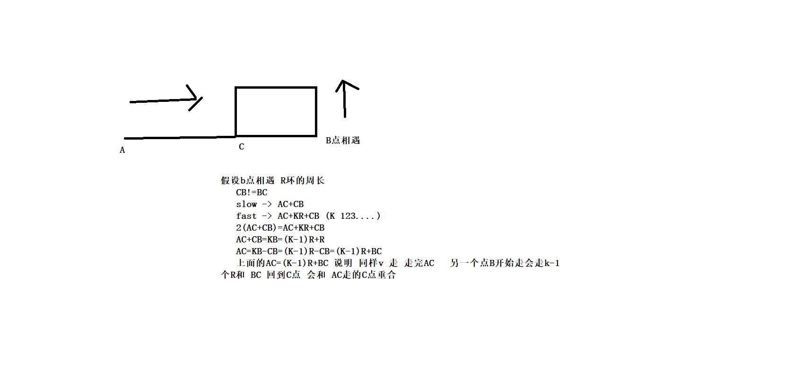

链表
```
1.怎样找到第一个入环节点
    简单方法
    head 开始 查询 hash表  
    if (存在){
        return node (返回的node)就是第一个环节点
    }  else{
        存入hash表
        node.next 在传入这个方法
    }

2.第二种方式求出 第一个入环点

 判断链表欧环并且环的入口
   fast 2 step 

   slow 1 step

 若fast 遇到 next节点未null说明不存在环链表
 
 fast继续走 slow 当他们在换里面遇到的时候  在把fast移到 head 然后 fast 和 slow 都走 1step  相遇的节点就是环入口节点 
```
链表环入口原理图
