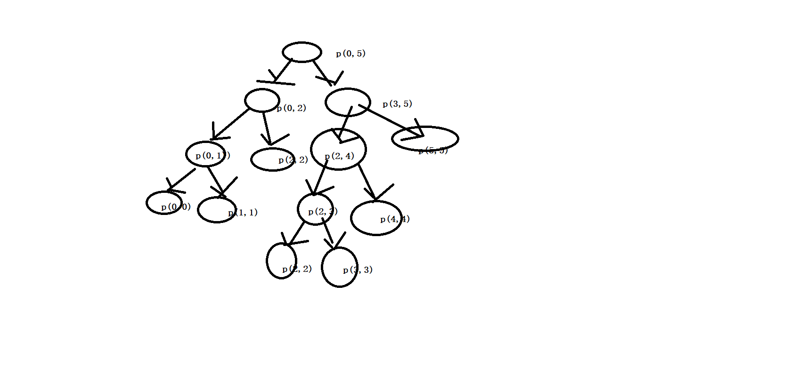

### 认识O(NlogN)的排序

```
递归行为和递归行为时间复杂度的估算


    求start end 两个数的中点 

       start+(end-start)>>1

      (star+end)/2 一般情况下是错误的但是有可能会造成错误，
      因为 start+end  在足够长的情况下有可能造成溢出 然后在/2 得出的结果就是错误的。  


```

```java
public class Recursion {
    public static void main(String[] args) {
        int [] array={1,2,3,4,5,33,3};
        int max = recursionMax(array, 0, array.length - 1);
        System.out.println("max:"+max);
    }
    public static int recursionMax(int[] array ,int leftIndex,int rightIndex){
        if (leftIndex==rightIndex)   return array[leftIndex];
        int midle=leftIndex+((rightIndex-leftIndex)>>1);
        System.out.println("left "+leftIndex+" right "+rightIndex +"midle "+midle);
        int leftV = recursionMax(array, leftIndex, midle);
        int rightV = recursionMax(array, (midle + 1), rightIndex);
        return Math.max(leftV,rightV);
    }
}


```
递归求最大值的图解



```
T(N)=a*T(N/b)+O(N^d);

T(N):母2问题数据量是N级别的
a:子问题调用的次数
T(N/b):子问题的数据是N/b级别的
O(N^d): 除了子问题外的的时间复杂度


上面的的递归
  N=rightIndex-leftIndex;

  然而子问题  
    int leftV = recursionMax(array, leftIndex, midle);
    int rightV = recursionMax(array, (midle + 1), 

    子问题数据量是N/2  并且调用了两次字子问题
  
子问题其余的都是常量时间复杂度 所以他的时间复杂度为O(1)

T(N)=2*T(N/2) +O(1)


时间复杂度的计算
①当d<logb a时，时间复杂度为O(n^(logb a))
②当d=logb a时，时间复杂度为O((n^d)*logn)
③当d>logb a时，时间复杂度为O(n^d)    


```


合并排序

```java
    public static void main(String[] args) {
        int a[]={1,2,1,4,5,33,3,2};
        process(a,0,a.length-1);
        System.out.println(Arrays.toString(a));
    }
    public  static  void process(int[] array,int L,int R){
        if (L==R) return;
        int mid=L+((R-L)>>1);
        process(array,L,mid);
        process(array,mid+1,R);
        merage(array,L,mid,R);
    }

    public  static void merage(int[] array,int L,int mid,int R){
        int tmp[]=new int[R-L+1];
        int tmpI=0;
        int p1=L;
        int p2=mid+1;
        while (p1<=mid&&p2<=R){
            tmp[tmpI++]=array[p1]<=array[p2]?array[p1++]:array[p2++];
        }
        while (p1<=mid){
            tmp[tmpI++]=array[p1++];
        }
        while (p2<=R){
            tmp[tmpI++]=array[p2++];
        }
        for (int i = 0; i < tmp.length; i++) {
            array[L+i]=tmp[i];
        }
    }
```


(归并排序)

求左边小值求和

```
    public static void main(String[] args) {
        int arr[]={1,3,4,2,5};
        int process = process(arr, 0, arr.length-1);
        System.out.println(process);
    }
    public static int  process(int arr[],int left,int right){
        if (left==right) return 0;
        int midle=left+((right-left)>>1);
        int v1=process(arr,left,midle);
        int v2=process(arr,midle+1,right);
        return  merge(arr,left,midle,right)+v1+v2;
    }

    public static int merge(int arr[],int left,int midle,int right){
        int _array[] =new  int[right-left+1];
        int value=0;
        int p1=left;
        int p2=midle+1;
        int nowP=0;
        //[...]   [....]  两个顺序数组都从开头开始进行比较
        while (p1<=midle&&p2<=right){
            value+= arr[p1]<arr[p2]?((right-p2+1)*arr[p1]):0;
            _array[nowP++]=arr[p1]<arr[p2]?arr[p1++]:arr[p2++];
        }
        while (p1<=midle){
            _array[nowP++]=arr[p1++];
        }
        while (p2<=right){
            _array[nowP++]=arr[p2++];
        }

        for (int i = left; i <= right; i++) {
            arr[i]=_array[i-left];
        }
        return  value;
    }

 N*0(log N) 的时间复杂度


 要有优于遍历求和的时间复杂度O(n*n)


```


QuickSort
```java
v1.0
    public static void main(String[] args) {
        int arr[]={1,2,3,4,3,312,1};
        process01(arr,0,arr.length-1);
        System.out.println(Arrays.toString(arr));
    }

    public static void process01(int array[],int start,int end){
        if (start>=end)return;
        int base=array[end];
        int pStart=start;
        int pEnd=end;//最后一个最大的
        while (pEnd>pStart){//==退出
            if (array[pStart]>base){
                pEnd--;
                swap(array,pStart,pEnd);
            }else{//<= base
                pStart++;
            }
        }
        swap(array,pEnd,end);//值固定
        process01(array,start,pStart-1);//把pEnd对应的索引空出来  因为这个位置已经确定
        process01(array,pEnd+1,end);
    }
    public static void swap(int array[],int i,int j){
        if(i==j) return;
        array[i]=array[i]^array[j];
        array[j]=array[i]^array[j];
        array[i]=array[i]^array[j];
    }


v2.0 荷兰国旗 排出 <a ==a >a   ==>  排出 ==a的在进行排序

    public static void swap(int array[],int i,int j){
        if(i==j) return;
        array[i]=array[i]^array[j];
        array[j]=array[i]^array[j];
        array[i]=array[i]^array[j];
    }
    //v2.0   <a  ==a  >a
    public static void process02(int array[],int start,int end){
        if (start>=end)return;
        int pStart=start-1;
        int pEnd=end;
        int base=array[end];
        int eqeCount=0;
        while (start<pEnd){
            if (array[start]<base){
                pStart++;
                start++;
            }else if (array[start]>base){
                pEnd--;
                swap(array,pEnd,start);
            }else {
                eqeCount++;
                start++;
                pStart++;
            }
        }
        swap(array,pEnd,end);
        process02(array,start,pEnd-eqeCount-1);
        process02(array,pEnd+1,end);
    }


由于我们选择数组的最后作为比较的值如果他的数为最大或最小这样就是 O(N*N)的时间复杂度 为了避免这种情况我们可以随机选择数组一个数然后把它放在最后 这样就是随机的情况 就能避免人为数据造成时间复杂度大

v3.0


最后的时间复杂度为 0(N*logN)

```


堆
```

```