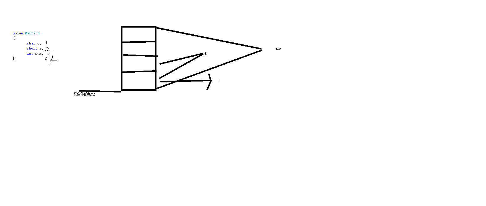

联合体和枚举

```

union u_name{
    xxx xx
    xxx xx
}

联合体
    内部所有成员变量地址一致
    联合体的大小是内部成员变量中最大的成员的大小      
    修改其中任意一个成员的值，其他成员都要修改


union MyUnion
{
	char c;
	short s;
	int num;
};    
```

联合体存储格式

```
这样存储的好处是节约内存空间
劣势 不能对元素进行修改 修改一个变量值 其他的变量也会改变


```


枚举
```
    enum e_name{
        A,
        B
    };


枚举常量的值是整形常量不能是浮点数，但是可以是负值
默认0开始 后面的常量默认为前一个+1


使用
    直接拿 A,B就能够用 和其他语言不通的是不需用 e_name.A ....


```


文件
```
printf 标准输出 stdout 1 文件

scanf 标准输入  stdin  0 文件        

perror 标砖错误  stderr 2文件

0 1 2 是系统文件 当前程序启动自动打开 程序结束自动关闭


文件指针和普通指针的区别
  FILE * p=NULL;
   
  避免文件指针的也指针

    fopen();-->相当于做了malloc操作
          FILE 其实是个结构体  

          fopen() 在磁盘上找到对应文件信息 把他加载到heap上(disk 和 heap 做的一个映射),在把对应的信息返回给我
    p=fopen();

    
    
    操作文件使用文件读写函数

        fputc    
        fgetc

        fputs
        fgets

        fread
        fwrite
  
   
注意 文件指针 f++ 不能使用


文件分类
    设备文件
        屏幕
        键盘
        disk
        net
        ......
    磁盘文件
        文本文件
        二进制文件 


 文件遵循的步骤
        1.fopen
        2.操作文件
        3.关闭文件。flose()            
            注意 系统文件不需要打开关闭 例stdin stdout stderr


函数
    FILE * fopen(const char *filename,char mode)
        filename 文件名 包含访问路径(绝对路径 or 相对路径)

       mode 文件的打开权限
            r 读 文件不存在报错
            w 写 不存在 创建 存在 清空打开
            a :append  ，不存在创建文件
            r+ 读写
            w+ 读写 不存在创建文件
            a+ 读 （写 追加） 不存在创建文件

   返回  
        succ  返回文件指针
        fail NULL


 int fclose (FILE *P)
    P 打开的文件指针

    反回值
    succ 0
    fail -1


相对路径
    	fp = fopen("b.txt", "w+");
        相对于当前的项目文件创建b.txt
        win
           编译执行  vs 下找的是 .vcproj的目录册位置
           执行文件执行  就是执行文件的目录的相对位置

        linux
            gcc       
            执行文件执行  就是执行文件的目录的相对位置


文件的操作

1. int fputc(char c,FILE *stream)
       c 带写入的字符
       stream  文件指针  fopen返回值
   
   return 
     succ 返回 写入的字符
     fail -1
例
    char c=  fputc('A', fp);
	if (c == -1)perror("fput eror");


2. int fgetc(FILE *stream)

    stream  文件指针  fopen返回值
    return 
        success 字符的对应的ascii

        失败-1

   读文件的时候读索引自动就移动

   文件中结束标记
        1.文件在fclose 的时候会帮我们家一个结束标记 EOF(-1)

   


3. int feof(FILE *stream)
  判断文件到达结尾的函数

   return 
        结尾 非0 true

        不是结尾 0 false 

  总结 ：是否判断文件的结尾

  特性 ：要想检测文件结束标记，必须在该函数使用读函数(更新文件位置指针)
    


```


```
都是变参函数 ...

printf(char str,...);  str固参
sprintf()
fprintf();


sprintf(buf,str,...) 把str格式化后写入buf中


fprintf(file,str,...)
file 是文件指针
```