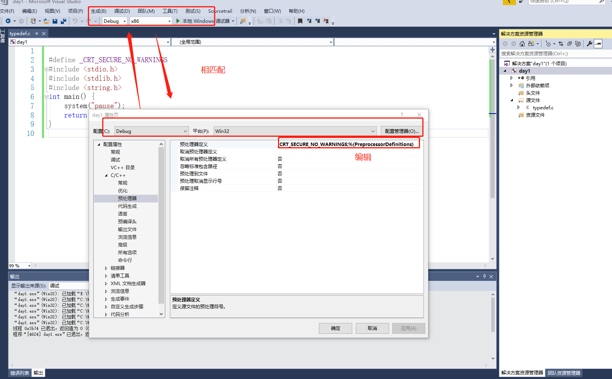
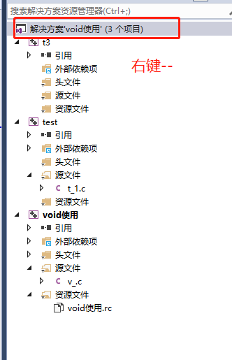
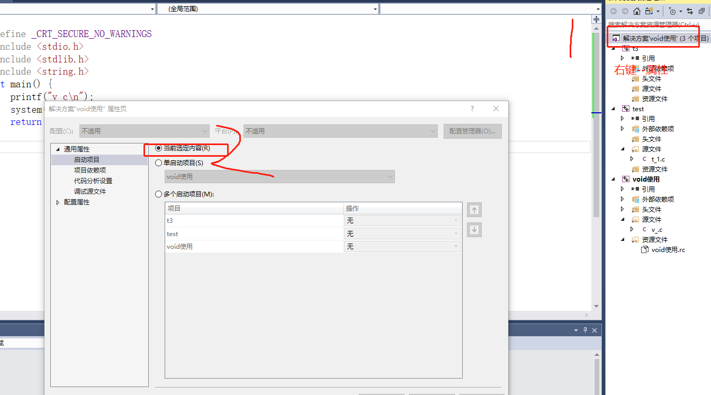

```c

int a =10
含义：在内存里面声明 4个 byte大小的空间 里面放着    。。。。。0000_1010
的二进制数据 a表示的是内存空间的别名


```

vs 下添加代码管理片段

```xml

工具-->代码管理

<?xml version="1.0" encoding="utf-8"?>
<CodeSnippets xmlns="http://schemas.microsoft.com/VisualStudio/2005/CodeSnippet">
	<CodeSnippet Format="1.0.0">
		<Header>
			<Title>#1</Title>
			<Shortcut>#1</Shortcut> //快捷键
			<Description>c语言代码管理</Description>//描述
			<Author>liuxin</Author>
			<SnippetTypes>
				<SnippetType>Expansion</SnippetType>
				<SnippetType>SurroundsWith</SnippetType>
			</SnippetTypes>
		</Header>
		<Snippet>
			<Declarations>
				<Literal>
					<ID>expression</ID>
					<ToolTip>要计算的预处理器表达式</ToolTip>
					<Default>0</Default>
				</Literal>
			</Declarations>
            // Language="c" 语言
			<Code Language="c"><![CDATA[
            //代码片段
      #define _CRT_SECURE_NO_WARNINGS
			#include <stdio.h>
			#include <stdlib.h>
			#include <string.h>
			int main(){
				system("pause");
				return 0;
			}
			]]>

			</Code>
		</Snippet>
	</CodeSnippet>
</CodeSnippets>

```

预编译在继承环境下设置
```
点击项目 (day1)-->项目-->属性-->配置属性-->预处理器
```

```c

注意 在vs下使用有的函数会报不安全可以使用
#define _CRT_SECURE_NO_WARNINGS
或者是按照上面的方法在vs继承环境里面的已处理器里面进行设置


1.起别名

结构体中使用
struct A
{
   int a;
   char str[100];
};

typedef struct A  S_t;

void test(){
    S_t a={100,"刘鑫"};
}


类型的使用
typedef char * p_char;


void t1(void){
	p_char pc1, pc2;
}


提高移植性
	C88
	C89
	...
	不同的标准下支持的标准不同
	我们可以使用自定义内省 这样在不同的标准下就只需要修改自定义类型一处地方就可以了

```

vs在同一个解决方案创建多个项目


```
添加--->新建项目


设置点击那个页面就激活那个项目


```




void 类型的使用

```
1.变量 【不能使用】 void类型 (不知道分配多少的内存空间)

2,限定函数的返回值 

3.限定函数的参数
	1. void a(){}
		调用的时候我们是可以用 a(100) 编译不会警告，报错

	2. 	void a(void){}
		 a(100) 这样调用的时候会报警告


3 void *	(泛型)
	什么类型的指针 都是4个byte大小的空间(占有内存的空间)

	可以不通过强制类型的转换就能够进行指针的类传值


```


sizeof的使用方式
```
返回 无符号类型


sizeof 不是函数是一个操作符(本质)

类型
	sizeof(类型)

变量  
	sizeof 变量
	sizeof (变量)


注意  无符号 和有符号运算 都转成 无符号


void calArrayLen(int  array[]) {
	printf("数组的长度:%d\n",sizeof(array));
}

*********
注意：这里有一个坑
	调用 calArrayLen(array) 你的数组不管多少元素
	都只会打印 4(无符号类型的参数) 
	其实在形参上面 array代表的是一个int 类型的指针的形参

	也就是说我们传入的数组其实就是传入的数组的索引为0的指针参数


```

## const
```
1.在普通变量下const修饰的变量不能修改

2.但是我们可以把
	const int a = 100;
	int* p_a = &a;
	*p_a = 200;

	通过指针的方式可以把const修饰的常量进行了修改


const 修饰指针
	1.const int *p;
		*p =100 x 不能进行赋值
		p=&b 是可以进行操作的 

	2.int const *p
		*p =100 x 不能进行赋值
		p=&b 是可以进行操作的 

	3.int * const p;
			*p =100  能进行操作
			p不能进行操作

	4. const int * const p;
			*p
			p
			都不能修改

总结 
	向右修饰  被修饰的部分只读

常用
	void a(const char *str)

	*str 不能修改  指针所指的内容不能修改

void c(const char *str) {
	char *cloneStr = str;
	printf("init cloneStr : %s\n", cloneStr);
	*cloneStr = "我是clone";//错误操作 只能读不能修改  权限 不够发出异常
	printf("after cloneStr : %s\n", cloneStr);
}


注意 第一次常量进行赋值之后然后经过赋值指针的方式进行赋值。然后在对它们的内存空间的内容进行修改，会报异常 (没有写的权限)


```

## 变量
```c
	结构体 变量 普通结构体修改
	struct Person p1 = {"刘鑫",24};
	结构体 变量指针修改
	struct Person *pp1 = &p1;
	pp1->age = 25;
	pp1->name = "刘鑫+1";
```


结构体 const
```c

struct Person
{
	char *name;
	short age;
};

const struct Person p2 = { "liuxin",24 };

(&p2)->age = 100;
p2.age = 100; 
使用p2 进行结构体里面的元素进行修改时不允许的


但是 
struct Person *p3 = &p2 ;
p3->name = "liuxin1";
p3->age = 25;

用p3结构体指针进行p2地址的赋值
在对里面元素的修改时能进行修改到的


默认结构体
test3(struct Person p) {
	
}
他是值传递

我们要对传入的结构体进行引用传递必须使用指针

test3(struct Person *p) {
	
}


1.当我们进行const 修饰结构体方法的形参
test3(const struct Person *p) {

}
	p->name = "sss";
	(*p).name = "ss";
	上面两种方式对const 修饰的结构体进行修改 编译都不会通过

	p = NULL;但是可以对他赋值为空


2.
test3( struct Person * const p) {

}
	p = NULL; 但是【不】可以对他赋值为空

	里面的值是可以进行修改的
	p->age = 100;
	(*p).age = 200;


即不让他吧结构体指针赋值为NULL也不让他对里面的值进行修改 
test3(const struct Person * const p) {

}


总结
	1.当const 左边修饰结构体 *p 时 (.......***p) 可以把p指针赋值为NULL,但是不能修改结构体里面的内容进行修改
	2.const 只修饰p时 不能把他赋值为NULL(不能修改指针的值),可以修改结构体的内容
	


```
