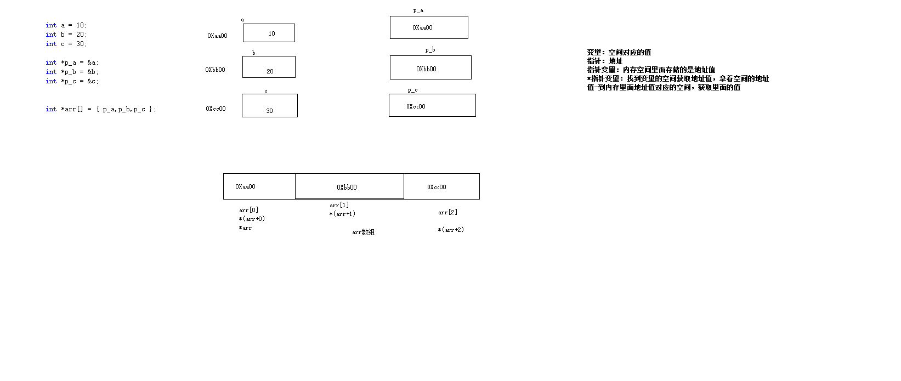

指针
```
指针 地址

内存单元：计算机中最小的内存单位(byte)

地址：内存单元的编号

	int a = 10;
	printf("a 的地址 %p \n",&a);

a 的地址 00BFFD80

 a的内存图 
 
 00BFFD83   0000 0000
 00BFFD82   0000 0000
 00BFFD81   0000 0000
 00BFFD80   0000 1010


指针变量:存储地址的变量


*p (解引用)  将p变量的内容取出，当成地址看待，找到p地址的内存空间。

做左值  存数据到空间中

右值  取出空间中的内容


指针类型的大小
    所有指针类型的大小为 4byte
    与数据类型无关
    只和操作系统的架构有关  32 位(4个byte) 64位(8个byte)


野指针
    int *p ;p 是操作系统的给的随机数作为地址 这样不行的
    int *p=1000 1000就是一个不能够访问的地址(经过测试报错的是没有写入读取的权限)
 
    定义：没有一个有效的地址空间叫做是野指针


    结论：指针的赋值一定要先申请空间，在进行拿空间的地址值对执行进行赋值


空指针
    NULL //0

    int * i_p=NULL

    if(i_int!=NULL){
        使用该指针
    }

    作用 ：是指针 不用出现投机的操作
    0-255 的地址不管是那个系统都是属于系统用的空间，其他的程序访问这个地址的空间都没有访问的权限


万能指针
    int a=15;
    void * p;

    p=&a;

  	int a;
	void *v_p;
	v_p = &a;

	printf("a value :%d\n", a);
    printf("*v_p vale: %d\n", *((int *)v_p));

    (int *)强转 高速程序我们他当成怎么类型看待 意思说高速程序我们那到地址-找到空间--取多少大小范围的数据


```


指针和数组
```c
数组名是地址常量
        常量：不允许修改

    int a[10] = { 0 };
	int b[10] = { 0 };
	a = b;//错误 常量不允许修饰

    
注意:两个数组名之间是不允许进行赋值操作的(数组名是地址常量)
    可有把数据名赋值个同类型的指针


	int a[10] = { 100 };

	int *p = a;

	for (size_t i = 0; i < sizeof(a)/sizeof(a[10]); i++)
	{
		int data = *(p+i);//p[i]  这个操作也是可以的

		printf("i:%d  v:%d \n", i, data);
	}


arr[0] 代表的含义
  arr[0]== *(arr+0)
  
  &(arr[0])==arr  地址形同

指针加减和地址的关秀 :所用对象到地址是加 index*(存储数据类型占空间的大小)


```

指针和变量的区别

```
    1.指针是变量  数组名是地址常量
    2.sizeof(指针)  4 /8  os相关
        sizeof(数组名) 数组所有元素的字节数的总和


```


指针++操作

```
取数组每个元素
	int a[10] = { 100,200 };
	
	int *p_a = a;

	for (size_t i = 0; i < sizeof(a)/sizeof(a[0]); i++)
	{
		printf("%p -- v: %d \n", p_a, *p_a);
		p_a++;
	}
	system("pause");

p_a++ 地址加的就是 int 占的内存大小


int *p *指针描述符

*p *解引用描述符


指针

数据类型对指针的作用
    1.间接引用 (从地址对应内存空间开始位置，向后读取的字节数)

    2.加减运算
        决定指针决定 — +1 地址的加的字节数


p++ 指针++有野指针的风险  
*(p+i) i=0,1,2,3...这样使用就不会出现野指针 这个指针值都没有改变


+-
    偏过 数据类型大小的字节*+=整数


数组中+-整数

    int a[10]={0};
    int *p=a;
    p+1//偏过一个元素 [偏过4个字节 字节数和数据类型相关]
    p-1


    int arr[10] = { 1,2,3,4,5,6,7,8,9,9 };
	int *p = arr + 5;
	printf("p-2 =%d\n", *(p - 2));


&数组名+1
    数组名:数组首元素地址值的常量

    &a 就是 数组首元素地址值的常量

    &a+1  +1加的是一个数组的大小(大小:数组元素的个数*每个元素占的大小)

    — +number  就是加减的数组的大小


指针+-指针的操作

   指针加指针 error不允许操作

   指针减指针 编译阶段不报错
    
            1 普通变量 语法允许 无实际意义
            2 数组来说 两个指针相减
                
                int ar1[10] = { 1,2,3,4,5,6,7,8,9,10 };

                int *p_1 = &ar1[3];
                int *p_2 = &ar1[0];
                printf("p1-p2=%p",(p_1-p_2));

                得到的是他们的索引相减的值

                意义：偏移过的元素的个数


自实现strlen()函数
方法A
size_t strLen(const char * str) {
	size_t num = 0;
	while (*(str+num)!='\0')
	{
		num++;
	}
	return num;
}

方法B

size_t strLenPointMethod(const char * str) {
	char * p = str;
	while ((*p)!='\0')
	{
		p++;
	}
	return p - str;//返回 地址之间有多少个元素
}


```


指针的比较

```
> <  ==


在编译阶段和运行阶段是能使用比较运算符的


数组是有意义的
对于普通的变量之间指针地址比较是没有实际意义的


变量判断是否为null
void pointCmp() {
	int * i_point = NULL;
	if (i_point == NULL)
		puts("null");
	else
		puts(" not null");
}


```


指针数组
```

int * arr[]={}
int * [] (整形指针数组)

里面元素存储的是整形的指针地址


指针数组他的本质是一个二级指针

一个存储地址的数组 数组内部所有元素都是地址


二维数组也是一个二级指针


```
指针类型的数组



