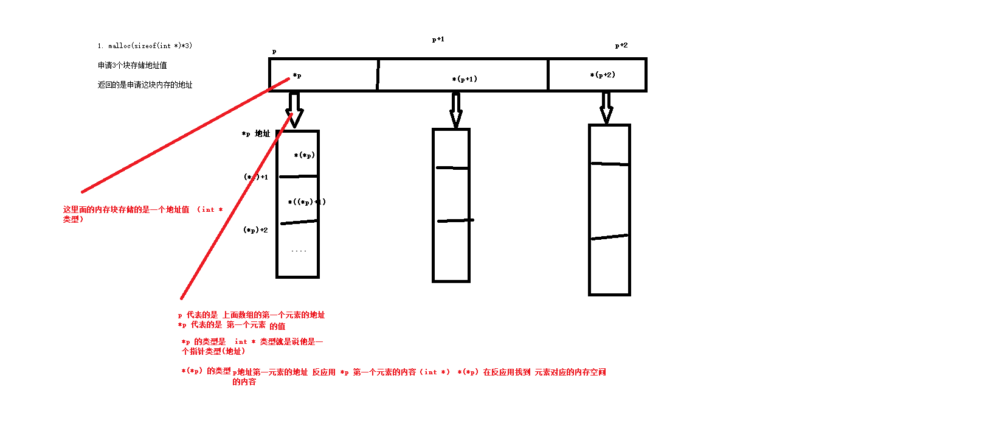

string.h

```
char* strchar(const char * str,int c)
在字符串中找字符(字符串中首次出现)的位置  返回字符的地址


char* strrchar(const char * str,int c)
    自由向左开始找第一个的地址返回


char* strstr(const char * str1,const char * str2)

    在字符串str中找子串substr 子串第一次出现的位置


字符串分割  
char * strtok(char *str,const char *delim)  按照既定的分割符来进行拆分字符串

   总结：
   会找到字符串第一个匹配的字符串，并且把匹配的字符换成\0


   strtok() 返回的值是才分后的的字符串


#include <stdio.h>
#include <string.h>

int main ()
{
  char str[] ="- This, a sample string.";
  char * pch;
  printf ("Splitting string \"%s\" into tokens:\n",str);
  pch = strtok (str," ,.-");
  while (pch != NULL)
  {
    printf ("%s\n",pch);
    pch = strtok (NULL, " ,.-");//1+次拆分
  }
  return 0;
}


atoi/atof/atol

字符串转int
字符串转浮点数
字符串转long


注意：
    要求代转的字符串必须可转才行


```


内存管理
```
局部变量
    定义：定义在函数内部的变量

    作用域：重定义位置开始到包裹第一个 }(括号结束)


全局变量
  定义在函数外部的变量我们叫做全局变量
  
  *** 全局变量的作用域 是本文件
  
  在多文件里面使用全局变量

  a.c
    int a=100; 全局变量

  b.c(若想在b.c中使用全局a.c中的全局变量)
    extern int a;


static 全局变量

   语法：在全局变量前加static关键字就是全局变量

   作用域：
      被限制在本文件内部   不允许到初次到其他文件进行使用 


static 局部变量
  在局部变量前，前面加 static关键字

  特性：静态局部变量只定义一次，在全局(作用域 是局部变量的作用域)

  作用域 ：和局部变量一样 变量后第一个  }结束

  运用场景：通常用来做计数器


全局函数
   函数


static 函数

    语法 static 函数原型+函数体

     作用域 ：只能够在函数内部使用。其他文件即使声明是无效的


```


内存模型
```

win
  代码段  .text

  数据段  .data
        .rodata  只读数据段
          常量  const
        .data  初始化数据段
          初始化为非 0的 全局变量  静态变量（全局+局部）
        .bss  未初始化数据段
            初始化为0和未初始化的全局变量和静态变量，
            程序加载程序前会将变量初始化为0
 

  stack  栈  win 1m-10m  linux  8m-16m
        操作系统自动分配释放
        
        普通局部变量放置的位置

  heap 堆
      用户自定义数据提供空间(用户自己申请) 1.3G +

      空间足够大


linux 32位os

    3-4 G 阶段是kernel 运行的空间

    0-3 G 是用户空间
        .text
        .rodata
                  上面两个段是只读的段


        .data
            初始化的去全局变量和静态变量(全局静态  局部静态)

        .bss  初始化为0的全局变量和静态变量 (全局静态  局部静态)


            会合并分成可读可写的权限
        标准库的加载的地方

        .heap
            存储方向  低--->高


        .stack
            高---->低


    
```


生命周期
```
  1.布局变量
    定义--->函数调用完成

    其实就是在函数内部
  
  2.全局变量
        程序启动定义--->程序终止


  3.static 全局 局部      (全局静态  局部静态) 
        程序启动定义--->程序终止
     

     static 变量的生命周期就是全局变量的生命周期,
     只是作用域和女全局变量不同


  4.全局函数和 static函数
      程序启动--->程序结束


  
```


```
1.当全局和局部变量重名
   就近原则
 
   
```

heap 空间的使用

```

void* malloc(size_t size)
  返回内存空间的首地址
  我们通常把他当做数组使用

void free(void *ptr)


注意：当我们使用完了我们申请的heap 空间一定要进行释放内存


使用对空间的注意事项
    1.heap上面申请的空间当成数组进行使用
    2.free后的空间不会立即失效
       做法  将他对应的地址指针设置为NULL
    3.free的地址必须是malloc 申请的地址否则会 异常出错

    4.如果malloc 之后的地址一定会变化，就需要使用 临时变量保存一份地址值

    
```


二级指针对应的heap空间

```
int **p (int **) malloc(sizeof(int )*10)

int**p ===int * p[] 数组的元素都是 int * 类型


二级指针案例

 #define _CRT_SECURE_NO_WARNINGS
#include <stdio.h>
#include <stdlib.h>
#include <string.h>
int main() {
	//int **p  =int * p[]
	//先申请p空间 size =3
    
	int **p = (int **)malloc(sizeof(int*)*3);
	//在申请 p 数组对应的元素地址 对应内存的空间 
	for (size_t i = 0; i < 3; i++)
	{
		p[i] = (int *)malloc(sizeof(int)*3);
		for (size_t j = 0; j < 3; j++)
		{
			p[i][j] = j;
		}
	}

	//打印数据
	for (size_t i = 0; i < 3; i++)
	{
		
		for (size_t j = 0; j < 3; j++)
		{
			printf("%d ", p[i][j]);
		}
	}

	//释放内存
	for (size_t i = 0; i < 3; i++)
	{
		free(p[i]);
	}
	free(p);
	p = NULL;

	system("pause");
	return 0;
} 


```

上面案例的图示


