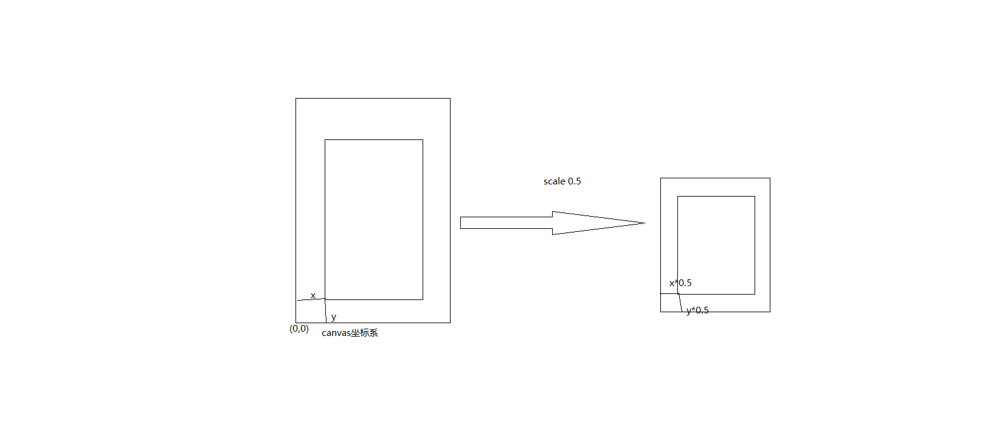

### Groot
```ts
单例使用
    调用 create()
    public static create(): GRoot {
            GRoot._inst = new GRoot();
            //顶层的GRoot容器 放到场景下面
            //scence 的坐标锚点为(0,0) 也就是左下角为
            GRoot._inst.node.parent = cc.director.getScene();
            return GRoot._inst;
    }


```


### Groot节点大小缩放的设置
```ts
_thisOnResized = this.onWinResize.bind(this);//设置Groot 根节点的大小
cc.view.on('canvas-resize', _this._thisOnResized); //canvas大小改变触发

```

### onWinResize
```ts

    private onWinResize(): void {
        let size = cc.view.getCanvasSize();//canvas大小
        //cc.winSize 为当前的游戏窗口的大小
        // getScaleX =canvasSize.width/winSize.width
        size.width /= cc.view.getScaleX();//结果size.width为 winSize.width
        //getScaleY =canvasSize.height/winSize.height
        size.height /= cc.view.getScaleY();//结果size.height为 winSize.height

        let pos = cc.view.getViewportRect().origin; //视的Rect对象 的 origin 对象  x,y 坐标为父节点的坐标系的坐标(rect 以左下角为原点)


        //getViewportRect 依据的坐标系是cocos 的最顶层canvas 左下角为原点的坐标系

        
        pos.x = pos.x / cc.view.getScaleX();
        pos.y = pos.y / cc.view.getScaleY();


        this.setSize(size.width, size.height);
        /*

        
        */
        this._node.setPosition(-pos.x, this._height - pos.y);//GRoot (0,0) 点左上角

        this.updateContentScaleLevel();
    }
```
pos.x = pos.x / cc.view.getScaleX();
pos.y = pos.y / cc.view.getScaleY(); 缩放



