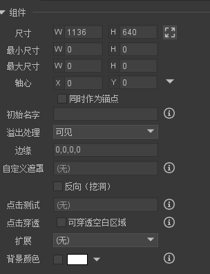
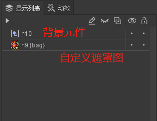

# 组件

## fairyui 和 cocos 区别 
```js
1.fairyui 锚点(0,0) 左上角
    cocos (0,0) 在左下角

2.组件
    this._node.setAnchorPoint(0, 1);组件的锚点(0,1) 左上角
    this._node.name = "GComponent";

    this._container = new cc.Node("Container");
    this._node.addChild(this._container);//创建一个容器添加到该组件下面

    //this._container  容器节点里面放着的是元件  

```


### 属性



#### 自定义遮罩的使用

```
1.创建一个遮罩的组件
2.创建一个遮罩元件和背景元件
    遮罩元件的排序在背景元件的下面
```



```
点击自定义遮罩-->然后到显示列表找到遮罩的图片-->点击完成

遮罩创建完成--把他拖到使用它的组件

默认不是反向的 (遮挡 自定义图片的位置大小)

若选择反向(遮挡背景遮挡组件上面的元件--自定义图片图形会显示组件上面的元件)


他们的遮罩颜色 rgba属性就是背景元件的颜色


```

