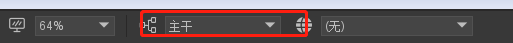
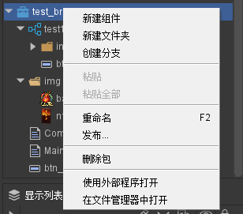
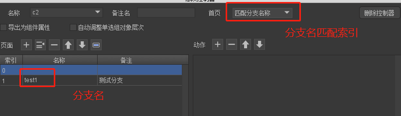
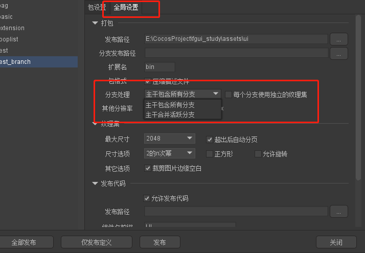

## 分支

#### 1.创建分支

```
文件-->项目设置-->项目分支-->+

```

#### 使用创建分支


```
1.在包里面创建指定的分支需要先切换到指定的分支

```



## 资源的映射方式

#### 图片和组件映射
```
1.组件名,或者图片名  相同分别在不同的分支 他们自动就建立一个映射


注意：创建映射  主干--分支 之间是弱连接关系

    1.删除分支的映射资源 (当变换分支的时候找不到分支的映射就会默认使用主干分支)

    2.删除主干资源 就直接不能显示


```


### 控制器 控制分支



```
切换分支来匹配控制器的索引

注意：
    在编辑器里面是切换分支控制器不管用，不许在测试环境下才有效

```

### 发布分支

```
主干包含所有分支:
    这种处理方式，可以在运行时再决定切换到哪个分支


主干合并活跃分支:
    首先都包含所有主干的内容
    然后查看哪些资源有分支映射关系的,就用分支的代替主干的(工具栏上面的显示的分支就是这个映射的分支)


    一句话就是说--先发布主干分支的资源--在查看工具栏上的分子

    if(主干){
        直接发布了
    }else{
        寻找工具栏上面有那些东西和主干的资源有那些是有映射关系的
        然后把分支上的映射资源把足感上的映射资源替换掉
    }


```


### 代码切换分支
```js
在创建任何UI之前 先设置分支
UIPackage.branch = "en";
```