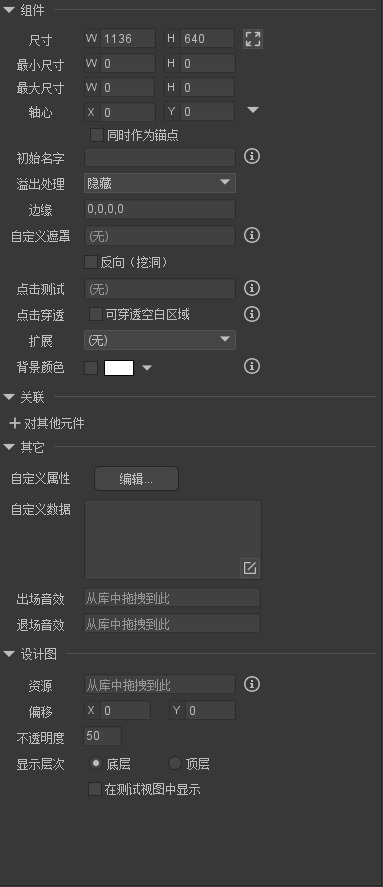

## 组件属性

```
组件:容器
    能包含组件+基础显示的对象


组件属性
    1.尺寸：w宽 h 高 设置容器的大小
    2.最大/最小 尺寸: default 0 不限制大小 ,设置该属性值【不对当前的尺寸进行改变，只对以后修改时进行限制】
    3.轴心 default (0,0) 左上角  该属性 是 旋转 缩放 ，倾斜的的轴心
    4.同时设为锚点: 会对组件下面的原件 的位置造成影响 【原件的(0,0) 位置是组件轴心位置】

    5.初始名字:   (用于编辑器内)  拖入另一个组件使用 他就变成一个基本显示的原件  名字就变成了初始化的名字


    6.溢出处理：表示处理超出组件矩形区域的内容的方式
            default 可见
            隐藏  操作组件这个容器范围影响(相当于 mask)

            垂直滚动 水平滚动 自由滚动.....

    7.边缘: 

```