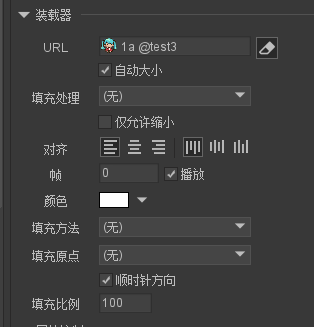

## 装载器
#### 基础
```
作用:动态加载资源

```


#### 实例属性


```
自动大小: 装载器 根据 内容自生的大小自动调整自身的大小

填充处理：
    无：内容不发生任何缩放
    等比缩放（显示全部）:【 按照最小比率缩放】，不变形，【一边可能留空白】
    等比缩放（无边框）:【 按照最大比率缩放，不变形】【，一边可能超出装载器矩形范围。】

    等比缩放（适应高度） 内容高度占满装载器高度，宽度等比缩放
    等比缩放（适应宽度） 内容宽度占满装载器宽度，高度等比缩放
    

    自由缩放 内容缩放至占满装载器矩形范围，不保持比例

    注意： 1. 当选中了自动大小，后面的填充就无意义
           2. 装载器自生没有裁剪的功能，如需要超出部分裁剪，则需要把装载器加入一个溢出隐藏的组件


   总结 自动大小：以资源的大小为目标变换 装载器大小

        填充处理:以装载器大小, 选择填充规则，资源大小根据填充的规则进行变换

        

```