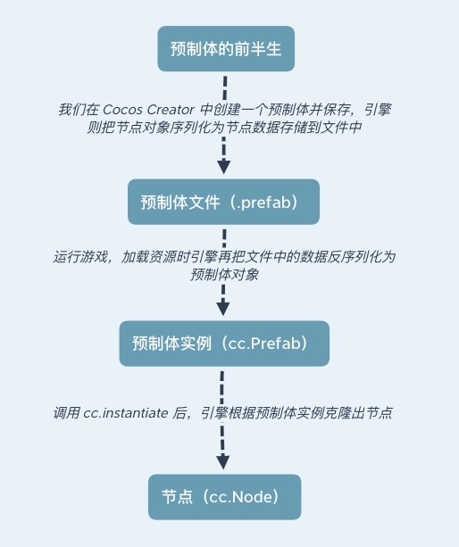
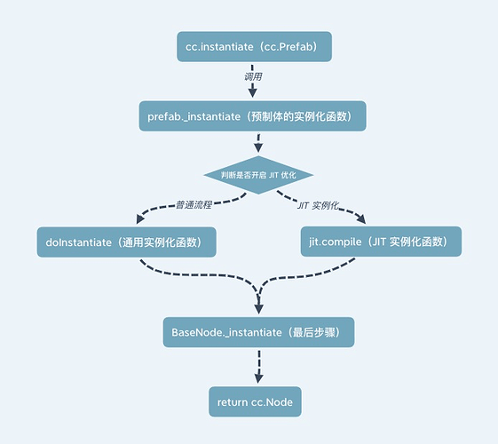
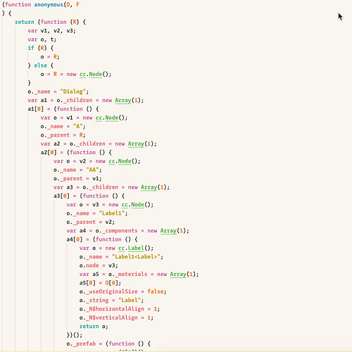
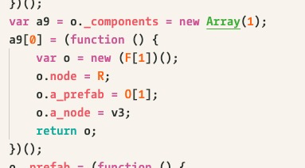

# 实例化预制体
```
xxx.prefab 实际上是一个json文件
cc.instance() 实际上是拿着他们的json文件克隆出一个cc.Node对象
```




```
上图是预制体实例化预制体的流程图


```


### ”优化多次创建性能“，“优化单次创建性能”，“自动调整”有什么不同？


```
自动调整 (默认)


**自动调整：**实例化时优先走普通实例化的流程，若实例化超过了 3 次，则在之后包括第 3 次会使用 JIT 优化实例化流程。

**优化单次创建性能：**实例化只走普通实例化流程。

**优化多次创建性能：**实例化只走 JIT 优化实例化流程。


```


## 介绍JIT实例化和普通实例化


```ts
1.普通实例化流程实际怎样进行的？？？
   cc.instance()的部分代码


    var clone;
    if (original instanceof CCObject) {
        if (original._instantiate) {
            clone = original._instantiate();
            return clone;
        }
        // ...
    }
    clone = doInstantiate(original);//实例化其他对象化
    return clone;


       cc.Prefeb 对象继承了 cc.Asset  
       cc.Asset 继承 CCObject
        cc.Prefab 会调用 _instantiate()函数


```

### 预制体的实例化流程


```
上面提到了不同的 CCObject 对象有不同的实例化函数，但这次只深入 cc.Prefab 的实例化

这里的 doInstantiate()函数和上面提到 实例化其他对象的doInstantiates是同一个函数(非Jit)


```

### doInstantiate函数

```ts
除了cc.prefeb的jit其他调用cc.instance()基本等于doInstance()函数

doInstance()的执行流程是
    1.创建一个空对象作为clone对象
    2.判断被克隆对象是否是 CCClass 对象（引擎内 cc.Node / cc.Component / cc.Prefab 等，使用了 @ccclass 装饰器的类都属于 CCClass 对象）
    3.如果是 CCClass 对象走 CCClass 对象克隆函数
    4.不是则走普通对象克隆函数


doInstance()普通对象是怎么进行克隆的？？


class MyClass {
    some_prop = 1;
}

let a = {
    b: {
        c: 1,
        map: new Map(),
        my: new MyClass()
    }
};

let obj = {
    a: a,
    same_a: a
};


克隆obj对象的过程是？？？
    1.创建一个空对象
    2.把空对象赋值给obj_iN$t属性
    3.遍历obj的属性找到第一个属性a
    4.属性a的值是一个对象，重复创建一个空对象，遍历属性并拷贝赋值的过程
    5.a的对象中有属性b,b是ES6的Map和类对象则不会拷贝直接引用原对象
    6.继续遍历obj对象找到第二个属性same_a,这个对象引用的同一个对象a
    7.由于是同一个对象a,而因为第一次拷贝对象a的时候，给a赋值了属性_iN$t,到第二次拷贝same_a的时候判断到a对象有_iN$t属性，说明a对象被拷贝过，那么就不在次拷贝而是直接返回iN$T属性的拷贝对象
    8.到此为止obj对象就完成了拷贝。


doInstance()CCClass 对象拷贝


CCClass 对象的拷贝其实和普通对象拷贝是差不多的，只不过引擎为了优化和解决某些问题而采用了几个不同的处理：


由于当拷贝节点或者组件时，引擎需要且只需要把序列化的数据拷贝，比如下面这个组件代码


@ccclass
export default class Main extends cc.Component {

    @property(cc.Prefab)
    a_prefab: cc.Prefab = null;

    @property(cc.Node)
    a_node: cc.Node = null;
    
}


在拷贝 CCClass 对象时，引擎只会拷贝 __values__ 中记录的属性，这就是与拷贝普通对象不同的第一点，在构造函数中添加 __values__ 记录序列化属性，解决只拷贝某些属性的需求，这也提高了性能。


```

## 实例化时进行的 JIT 优化的原理是什么？


```

JIT 优化只会在你选择的 “优化策略” 不是 “优化单次创建性能” 的时候才进行，并且部分平台是不支持的，比如微信小游戏。


把整个实例化过程通过字符串拼接，生成一个没有遍历，没有分支的实例化函数。


```




```ts

上面是实例化这个 Dialog 预制体的代码，也就是如果预制体被 JIT 优化后，所有上面 doInstantiate 做的一系列判断，遍历，拷贝的实例化操作都会变成赋值操作，而这也很明显更容易被 JavaScript 引擎直接编译，能降低不少的性能消耗。


重复创建多次创建

prefab.compileCreateFunction();//手动预先JIT

//多次创建的话JIT在会比自动(普通)实例化快50%
//第一会比较浪费时间


```

## 那么在编辑器拖节点要比 getChild 更好？
```
由于 JIT 优化后，在编辑器拖节点直接就是赋值操作，基本没有可比性，如下图：
```



```
这是上面我提到的 Main Component 经过 JIT 优化后的实例化代码，可以看到 a_prefab 和 a_node 属性都是直接赋值为 Creator 上绑定的节点。


手动Prefeb
prefab.optimizationPolicy = cc.Prefab.OptimizationPolicy.MULTI_INSTANCE;
prefab.compileCreateFunction();


```

