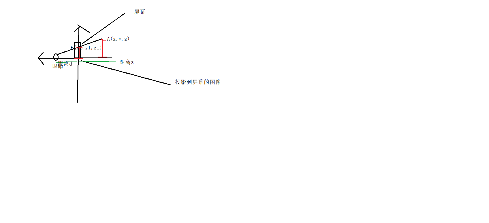

## 正交投影

```
特点： 一个图像是什么投影到屏幕就是什么样

当一个物体距离屏幕的z 轴相差的距离为d


当屏幕在Z1为0的时候
A(x1,y1,z1) A正交投影到屏幕上的坐标 
B(x2,y2,z2) B dst 的坐标

x1=x2
y1=y2
z1=0


根据上面算式可知举证

[1,0,0,0
 0,1,0,0
 0,0,0,0
 0,0,0,1
]
```

##  透视投影


```
根据上面的A点和B点到关系

根据相似三角形

x1/x=d/(d+z)=y1/y
x1=xd/(d+z)
y1=yd/(d+z)
z1=0


我们先把x y压扁 压成 以B点位屏幕top的正交投影

举证为
   [  1,0,0,0
      0,1,0,0
      0,0,1,0
      0,0,1/d,1
   ]

   经过计算
     x1=x
     y1=y
     z1=z
     w=(a+d)/d //齐次

    x1=xd/(a+d)

    y1=yd(a+d);

    z1=zd/(a+d);

    w=1

z1!=0 说明把门先把他压成了正交投影的方式 还应该进行正交投影 
         获得的xyz1在和 正交投影的矩阵相乘

         [1,0,0,0
          0,1,0,0
          0,0,0,0
          0,0,0,1
                 ]


  根据

x1=xd/(d+z)
y1=yd/(d+z) 


z增大 反比 x1 ,y1减小

d 减小 正比  x1,y1减小
```