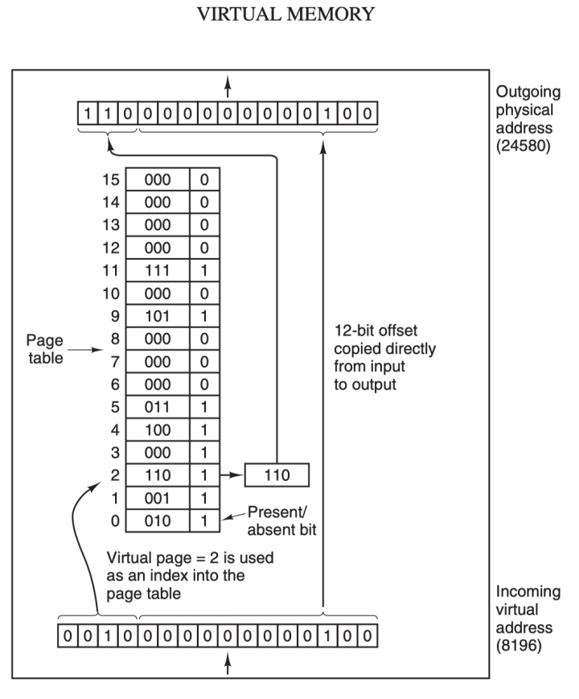
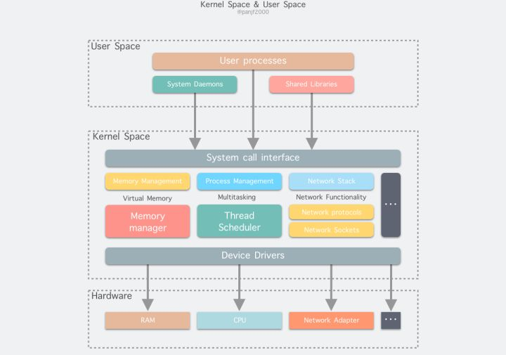
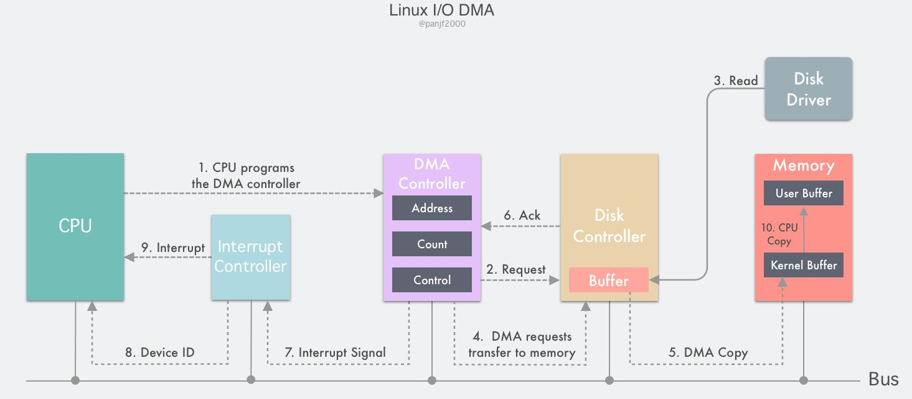

# Zero Copy技术
```
现带网络应用的性能瓶颈:I/0

传统的Linux io 接口 数据拷贝操作
    什么是数据拷贝操作？
        1.os kernel 缓冲区------>application 缓冲区  之间进行传输
        
        设置缓冲好处：减少disk io  
            当数据未放在缓冲区-->访问数据就要进行 磁盘 io-->会依赖(深度)cpu去操作 -->拷贝数据的时候会极大依赖cpu-->导致极大的系统的开销-->这样会导致传输效率非常慢

    io效率低下，这样有会影响网路服务器性能地下-->根据木桶规则，io是他的短板(瓶颈)-->解决了这个问题-->网络服务器性能也会提高

```


## 计算机存储器

```
存储器理想状态具备的特征
    1.速度快
    2.容量大
    3.价格便宜

很显然我们的计算机无法满足条件

由上图可知
    寄存器、高速缓存、主存和磁盘 这些存储器的速度递减的容量是递增的


    寄存器：
        32位cpu r32bits
        64位cpu r64 bits

        容量小价格非常昂贵

    高速缓存   
              

    主存(RAM)
        作用:与cpu直接交换数据的内部存储
        速度快

    磁盘
        便宜，效率低

```


## 物理内存

```
加载各式各样的程序与数据以供 CPU 直接运行和使用。

```


## 虚拟内存

```
虚拟内存的出现解决了程序日益增加的内存需求。


mov cx, 2
mov bx, 1000H
mov ds, bx
mov [0], cx

...

mov ax, [0]
add ax, ax


1.绝对地址访问内存
当使用绝对地址作为访问物理内存,并发执行程序可能会对进程间产生互相干扰。(修改到到同一绝对地址上)
因此上面的绝对地址访问内存的方案是不可行的方案

2.相对地址 (每个进程有一个自己的地址) index=0 开始进行访问
   物理地址=进程地址+index

    若个16kb的程序AB
    A：0-16384
    B: 16384-32768


    A的 第一条指令 jmp 1024   1024处是一条 mov next一条 add 

    B的第一条指令 jmp 1028  1028处 mov  next一条 add 指令 


    这两个程序共享的是寄存器-虽然使用的是各自的相对地址但是本质上操作的是绝对的内存地址--有可能会非法进行操作其他程序内存的内容  cs 是共享的 所以他们是cs+index 


3.静态重定位
    工作原理：当B程序加载到内存16384后，当执行jmp 1028 的时候-就会把jmp 1028+16384 去执行对应的指令，但是这个技术并不通用，而且对程序装载金内存有性能上的影响


4.存储器抽象:地址空间(就好像进程是CPU的抽象，地址是存储器的抽象,每个进程分配独享的地址空间)

    会出现新的问题:
        如何实现不同进程，相同的相对的地址实现不同的物理地址？？？

        答：
            1 最开始使用的是【动态重定位技术】  简单的地址空间到物理内存的映射方法
            cpu 配备了两个寄存器 基地址存储器+界线存储器(动态保存程序的起始地址 base address 和 程序的长度 length )

            A  0 -16384
            B 16384 - 32768

            当我们每次访问内存地址的时候 cpu 会自动把基地址寄存器 加到内存地址上 得到一个正确的内存地址 同时还会根据界线寄存器的值检查得到的内存地址是否溢出，若溢出产生错误终止程序

            问题 每次访问内存都会进行加法和比较运算，加法运算由于进位传递时间的问题，除非使用特殊的电路，否则会比较慢。


```
5,交换 swapping 技术


```

什么是交换技术？？？
    简单来说就是动态的把程序在内存和磁盘之间进行交换保存，要运行一个程序的时候吧程序的代码段和数据段调入内存，然后在把程序封存封存，存入磁盘，如此反复？？？

    为什么要这样呢？(swapping)
        前面的重定实现起来有一个前提空间足够的大，能够把他们全部加载到进程，才能并发运行这些进程，但是内存是有限的，所以就需要一种方法来处理内存【超载的情况】，【交换技术就是处理内存超载的问题】


   上图
    进程A换入内存 --启动进程BC--A从内存交换到磁盘--D进程加载到内存用了A进程退出之后的内存空间--A又被重新加载到内存，这时候内存布局又发生了变化所以A在换入内存时会通过软件和（基地址寄存器+界线寄存器）对A进程进行重定位


```


6 虚拟内存技术

```
这个技术也是和swapping技术一样处理内存超载的技术


虚拟内存核心原理？？
    为每个程序设置一段"连续"的虚拟地址空间(把这个地址空间分割多个具有连续地址范围的页--并把这些页和物理内存做映射)。在程序运行期间，动态映射到物理内存。

    当程序引用到一段物理内存地址空间时,硬件立即执行必要的映射；而当程序引用到一段不在物理内存的地址空间时，由操作系统将缺失的部分装入物理内存并重新执行失败的指令


    上图 虚拟内存的图


    内存分割-- page(固定大小)若干--物理内存对应的是page frame (页框) 图中是4k 在实际os中一般是512 byte到1GB 其实这种技术就是虚拟内存中的分页技术


    在32位架构中 
        虚拟内存空间分配的大小是4GB，在实际上当然不可能将所有运行中的进行分配4GB的物理内存，所以虚拟内存还需要利用到前面的交换(swapping),在进程运行区间只分配映射到当前使用的内存，暂时不使用的数据则写回磁盘作为副本保存，需要用到的时候在读入内存，动态的和内存之间进行数据的交换


```

### MMU (Memory Management unit)


```
进程在运行期间的内存地址都是虚拟地址，如果计算机没有引入虚拟内存这种存储的抽象的技术的话，则cpu会把这些地址直接发送到内存地址的总线上，直接访问和虚拟地址相同值的物理地址;如果使用的虚拟内存技术的化，cpu则是把这些虚拟地址通过总线从到内存管理单元(mmu) ，mmu将虚拟地址映射为物理地址之后再通过内存总线去访问物理地址


    虚拟地址(比如16)=虚拟页号(高位部分)+偏移量(低位部分)
    

``` 


## page table


```
  虚拟地址(比如16)=虚拟页号(高位部分)+偏移量(低位部分)

    页表 =页框号+修改位+访问位+保护位+(在/不在)

    给mmu传入虚拟的页号-->mmu会但会返回物理页框号 -->把物理页框号赋值到寄存器的高3位，把12位的偏移量赋值到寄存器末12位，这样就构成了15位的物理地址，把得到的物理内存发送到内存总线

    寄存器=(3bits 物理页框好)  +(12 bits 偏移量)=15位的物理地址


    2^12=4096 byte=4k(一个页框的内存大小)

    页框号*2^12+偏移地址=物理的地址=15bit


 "在/不在位"=0 表示的页面并映射到真实的物理页框--会引发一个缺页中断--cpu陷入os kernel -->通过页面的置换算法置换出一个页面将他换出以便为即将调入的新页面腾出位置，若要换出的页面已经被设置过 ，则这是一个脏也，需要写回磁盘更新磁盘的副本，若页面是干净(也就是没有被修改过)--则调入的新页面覆盖掉换出的旧页面即可


转换检测缓冲器  （Translation Lookaside Buffer，TLB）也叫快表
    作用：是用来加速虚拟地址映射的，因为虚拟内存的分页机制，页表一般是保存内存中的一块固定的存储区，导致进程通过 MMU 访问内存比直接访问内存多了一次内存访问，性能至少下降一半，因此需要引入加速机制，即 TLB 快表

    可以简单的理解成是表的高速缓存--保存了高频访问的页表项--硬件实现 速度极快


    cpu --mmu--tlb--地址总线
               计算---tlb存储--地址总线      


```


## 用户态和内核态


```
内核：控制计算机硬件资源,并提供上层应用的运行环境

用户：上层应用程序 (进程) 的运行空间，应用程序 (进程) 的执行必须依托于内核提供的资源，这其中包括但不限于 CPU 资源、存储资源、I/O 资源等等。


32位os 寻址空间 2^32=4G

os kernel 可以访问受保护的内存空间 ，也可以访问底层硬件的所有权

保护os kernel 内核的安全
os将虚拟内存划分为两部分=内核空间+用户空间

linux os而言
    最高的1G(0xc0000000 到 0xffffffff ) 内核的空间

    较低3G字节(0x00000000 到 0xbfffffff) 用户空间


linux和unix 设计哲学之一：对不同的操作赋予不同的执行等级(也就是特权概念)
    intel x86 cpu 提供4个职级(0-3) 越小特权越高

    linux 用了 1 和 3两个职级 分别代表内核态和用户态


   用户态的进程执行的操作和访问资源受到极大的限制

   内核态的进程可以执行任何操作并且在资源的使用上市没有限制的。


    用户态的程序--有时候需要内核态的权限才能进行执行
    例： c库 malloc()函数--sbrk()系统调用来分配内存 

    用户进程怎样切换到内核状态去使用那些内核资源？？？

        1.系统调用
        系统调用：用户进程主动发起的操作。用户态进程发起系统调用主动要求切换到内核态，陷入内核之后，由操作系统来操作系统资源，完成之后再返回到进程。
        2.异常
            异常：被动的操作，且用户进程无法预测其发生的时机。当用户进程在运行期间发生了异常（比如某条指令出了问题），这时会触发由当前运行进程切换到处理此异常的内核相关进程中，也即是切换到了内核态。异常包括程序运算引起的各种错误如除 0、缓冲区溢出、缺页等。
        3.中断
            中断：当外围设备完成用户请求的操作后，会向 CPU 发出相应的中断信号，这时 CPU 会暂停执行下一条即将要执行的指令而转到与中断信号对应的处理程序去执行，如果前面执行的指令是用户态下的程序，那么转换的过程自然就会是从用户态到内核态的切换。中断包括 I/O 中断、外部信号中断、各种定时器引起的时钟中断等。中断和异常类似，都是通过中断向量表来找到相应的处理程序进行处理。区别在于，中断来自处理器外部，不是由任何一条专门的指令造成，而异常是执行当前指令的结果。


```


### linux内部分级
用户空间
内核空间
硬件



### IO缓冲区

```
上图是用户数据(user data)到达磁盘(disk)的流程图

图中黑线是用户态和内核态的分界线


read(2)/write(2) 


    kernel buffer cache (缓冲区缓存)  io缓存细分为 page cache 和 buffer cache 


disk 磁盘


读磁盘: 内核会先检查 page cache 里是不是已经缓存了这个数据,存在，读取返回，否则，则穿透到磁盘里去读取，然后在保存到Page Cache里面，以备下次缓存命中


写磁盘: 内核直接把数据写入 Page Cache,并把对应的页标记为 dirty，添加到 dirty list 里，然后就直接返回，内核会定期把 dirty list 的页缓存 flush 到磁盘，保证页缓存和磁盘的最终一致性。


IO缓存区:
可以看出，所谓 I/O 缓冲区缓存就是在内核和磁盘、网卡等外设之间的一层缓冲区，用来提升读写性能的,当我们要记载新的缓存的时候这个时候旧的缓存会通过页面置换算法(如LRU)定期去淘汰旧的页面


在Linux还不支持虚拟内存技术之前
Buffer Cache 是基于磁盘最小单位 (块) 来进行的,所有的缓存都是用Buffer Cache来加速的,所有的磁盘块操作都是通过 Buffer Cache 来加速

linux支持虚拟内存机制之后 page 是内存管理的最小单位。引入page cache 来缓存linux文件的内容;主要用来作为文件系统上的文件数据的的缓存，提升读写性能。常见的是针对文件的 read()/write() 操作，另外也包括了通过 mmap() 映射之后的块设备


    也就是说Page Cache 负责了大部分的块设置的文件缓存工作。而buffer cache 用来在对块设备读写的时候，对块进行数据缓存来使用
```


```
上图(linux2.4版本之前)
    Buffer Cache 对粒度更细的设备块的缓存,而 Page Cache 是基于虚拟内存的页单元缓存，因此还是基于Buffer Cache,

    会造成问题
    1.在内存里缓存两份相同的数据，这就会导致同一份文件保存了两份，冗余且低效。
    2.当我调用write()之后，buffer cache 才是有效数据可能会造成buffer cache 和 page cache里面的数据不一致
      解决：有基于磁盘文件系统的 write，都需要调用 update_vm_cache() 函数，该操作会把调用 write 之后的 Buffer Cache 更新到 Page Cache 去

```


### linux 2.4 版本以后


```
融合之后就可以统一操作 Page Cache 和 Buffer Cache：处理文件 I/O 缓存交给 Page Cache，而当底层 RAW device 刷新数据时以 Buffer Cache 的块单位来实际处理。
```


## IO模式

```
linux或者 uninx-like 系统里面，IO模式一般有三种

1.程序控制 I/O
2.中断驱动 I/O
3.DMA I/O

```


### 程序控制 I/O


```
叫等待或轮询：用户通过发起一个系统调用，陷入内核态，内核将系统调用翻译成一个对应设备驱动程序的过程调用，接着设备驱动程序会启动 I/O 不断循环去检查该设备，看看是否已经就绪，一般通过返回码来表示，I/O 结束之后，设备驱动程序会把数据送到指定的地方并返回，切回用户态。


read()-system call-> 切换到 内核io处理程序 -查看存储有没有

有  把数据传输达指定的地方-->切回到用户程序


无-->通过循环等待判断disk 状态读取数据，读取完后-->存入数据到缓存-->咱爸数据放到指定的地方-->在切回用户程序


```


## 中断驱动IO


```
流程
    1.user process call  read()   function ,陷入 内核态并由其所在的CPU(正在处理他的处理器),写入一个通知信号并告知磁盘控制器要读取数据。

    2.磁盘控制器读取数据的过程，就是把数据拷贝到磁盘控制缓存里面去。

    3.磁盘控制器数据把数据拷贝完，disk controller 通过 总线发送一条中断信号到中断控制器
        如果中断控制器此时正在处理中断，并且正在处理的这个中断优先级更高，则这个中断信号(磁盘控制器发送的信号)将被忽略。，磁盘控制会在后续持续发送中断信号，知道中断控制器对这个信号的处理。
    4. 中断控制器接收到磁盘控制器接的中断信号之后会通过地址总线存入一个磁盘设备的编号。(表示这次关注的是磁盘)

    5.中断控制器向cpu置起了一个磁盘中断信号 
    6.cpu接收到中断号之后会立即停止当前的工作，把当前的寄存器，一些重要的数据压倒栈中。（备份数据用于中断处理完之后恢复），从地址总线取出设备编号，通过编号找到中断向量里面的 基地址和偏移地址(服务的入口地址),把他存入pc 寄存器（c ip） 开始运行中断服务，把数据从磁盘缓冲区拷贝到内核缓冲区;


    7.cpu把数据重内核缓冲区，拷贝到用户缓冲区，拷贝完之后 read()返回，切回到用户态


```


## DMA IO

```
并发系统的性能高低根本，是取决于如何对 CPU 资源的高效调度和使用
而回头看前面的中断驱动 I/O 模式的流程，可以发现第 6、7 步的数据拷贝工作都是由 CPU 亲自完成的，也就是在这两次数据拷贝阶段中 CPU 是完全被占用而不能处理其他工作的，那么这里明显是有优化空间的；第 7 步的数据拷贝是从内核缓冲区到用户缓冲区，都是在主存里，所以这一步只能由 CPU 亲自完成，但是第 6 步的数据拷贝，是从磁盘控制器的缓冲区到主存，是两个设备之间的数据传输，这一步并非一定要 CPU 来完成，可以借助 DMA 来完成，减轻 CPU 的负担


DMA:DMA 全称是 Direct Memory Access，无需CPU参与，提供存储器和外设和存储器和存储器之间的高速数据的传输


上图的执行流程

DMA控制器:里面有若干个可以被CPU读的寄存器：一个主存地址寄存器MAR(存放交换数据的主存地址)，一个外设地址寄存器ADR(存放IO设备的设备码，或者是设备信息存储区的寻址信息)，一个字节数据存储器WC(对传送数据的总结数进行统计)，和一个或多个控制寄存器。


1.用户进程-->read()-->陷入内核态-->cpu对DMA进行设置 把内核缓冲区的地址和设备信息分贝存入MAR和DAR寄存区里面，把期望读取的字节数存放到WC寄存器，启动DMA


2.DMA控制器根据ADR寄存器的信息，而知道这次I/0读取的的是外设磁盘的某个地址。向disk发出一个命令，通知它从磁盘读取数据到内核的缓冲区。


3.磁盘控制器启动磁盘读取的过程，把数据从磁盘拷贝到磁盘控制器缓冲区里，并对缓冲区内数据的校验和进行检验，如果数据是有效的，那么 DMA 就可以开始了；(检验数据是否有效可读)


4.DMA 控制器通过总线向磁盘控制器发出一个读请求信号从而发起 DMA 传输，这个信号和前面的中断驱动 I/O 小节里 CPU 发给磁盘控制器的读请求是一样的，它并不知道或者并不关心这个读请求是来自 CPU 还是 DMA 控制器；(请求disk controller 读取数据)


5.紧接着 DMA 控制器将引导磁盘控制器将数据传输到 MAR 寄存器里的地址，也就是内核缓冲区；


6.数据传输完成之后，返回一个 ack 给 DMA 控制器，WC 寄存器里的值会减去相应的数据长度，如果 WC 还不为 0，则重复第 4 步到第 6 步，一直到 WC 里的字节数等于 0；


7.收到 ack 信号的 DMA 控制器会通过总线发送一个中断信号到中断控制器，如果此时中断控制器手头还有正在处理的中断或者有一个和该中断信号同时到达的更高优先级的中断，则这个中断信号将被忽略，而 DMA 控制器会在后面持续发送中断信号直至中断控制器受理；


8.中断控制器收到磁盘控制器的中断信号之后会通过地址总线存入一个主存设备的编号，表示这次中断需要关注的设备是主存

9.中断控制器向 CPU 置起一个 DMA 中断的信号；

10.CPU 收到中断信号之后停止当前的工作，把当前的 PC/PSW 等寄存器压入堆栈保存现场，然后从地址总线取出设备编号，通过编号找到中断向量所包含的中断服务的入口地址，压入 PC 寄存器，开始运行 DMA 中断服务，把数据从内核缓冲区拷贝到用户缓冲区，完成读取操作，read() 返回，切换回用户态


```


## 传统 I/O 读写模式


```
有上图可知

可以清楚看到这里一共触发了 4 次用户态和内核态的上下文切换，分别是 read()/write() 调用和返回时的切换，2 次 DMA 拷贝，2 次 CPU 拷贝，加起来一共 4 次拷贝操作。


通过引入 DMA，我们已经把 Linux 的 I/O 过程中的 CPU 拷贝次数从 4 次减少到了 2 次，但是 CPU 拷贝依然是代价很大的操作，对系统性能的影响还是很大，特别是那些频繁 I/O 的场景，更是会因为 CPU 拷贝而损失掉很多性能，我们需要进一步优化，降低、甚至是完全避免 CPU 拷贝。

```


## 零拷贝


1. 什么是零拷贝？？
```
    零拷贝技术是指计算机执行操作时，CPU不需要先将数据从某处内存复制到另一个特定区域。这种技术通常用于通过网络传输文件时节省 CPU 周期和内存带宽。
```


2. Zero-copy 能做什么？
```

```