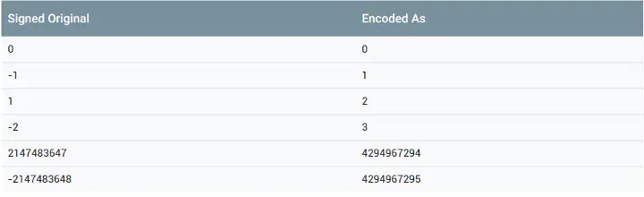

# ProtoBuf

什么是protobuf
```
ProtoBuf 是结构数据序列化方法

优势：
    1.语言无关、平台无关。
    2.高效。(比传统的xml数据包小) 简单
    3.扩展性好，高效


序列化：
      结构数据或对象转换成能够被存储和传输（例如网络传输）的格式

```


### ProtoBuf - 编码

编码结构


```
    TLV 即 tag-length-value 
        tag:唯一标识
        length:数据域的长度
        value:数据本身

上图可知
    
    filed=tag+length(可选)+value
    根据不同的类型会变成 filed=tag+value 的形式    

    tag 采用的是Varint编码
    tag=filed_namber+wire_type

tag:(整个tag采用varint 编码)
    filed_number 定义字段的编号
    wire_type:protobuf编码类型;

 wire_type :大小3 个 bit 总共可以表示8种编码(但是protobuf现在只定义了6中编码)

 
```
wire_type 6中编码


```
上图
    第一列代表对应的是wire_type编码的编号
    第二列为面向最终编码的编码类型
    第三列是面向开发者的 message 字段的类型。


  注意：
    strt group 和 end group 两种类型已经被遗弃  


message=filed+filed+.... 

 filed格式
    filed = tag+value // varint,64_bit 32_bit 类型
    or
    filed=tag+length+value // type==2 编码类型


我们接受到一条二进制数据 ---->先读一个varints编码块(tag)-->对他进行解码-->读取最后3个bit得到 wire_type类型(我们就知道了我们后面的value采用的是那种编码)-->获取tag前面的数据(也就是filed_number有次可知识哪一个字段)-->在一句wire_type正确读取后面的value --->...继续读取下一个字段

```

### 补码
```
符号位  
    #000 0000

    #第一位表示的符号位

     原码：就是一个数的二进制表示
        15 原码 0000 1111
        -15 原码 1000 1111

     反码: 正数 和原来的一样 负数 除了符号位其他的全反 
        例:
            15 的反码 0000 1111
            -15的反码 1111 0000 =-16   =-128+2^4+2^5+2^6

      补码:正数的补码就是原码,负数的补码在反码的基础上+1
         -15 =1111 0000 +1=1111+0001=-15


```


### Varints编码

补码：解决计算机中表示负数的问题
    正数 补码表示本身
    负数 补码符号位不变，其余取相反数


```
    规则:
        1.每个字节开头设置了msb(most significant  bit ) -->标记了是否读下一个字节

        2.存储数对应的二进制补码
        3.补码的低位排在前面(为移位做的一个小优化)


        int32 val=1;
        源码 0000 ... 0000 0001

        补码 0000 ... 0000 0001

        Varints 编码：0#000 0001（0x01）  // 1 的 Varints 编码，其中第一个字节的 msb = 0


例1：
编码过程
    数字1补码 0000 ... 0000 0001
    只需要取出第一个7位组因为前面全为 0 ,所以第一个7位组的msb为0 
    0 | 000 0001  


解码过程
    编码结果为  0#000 0001（0x01）
    每一个byte第一个bit为msb
        msb=1 还需要在读下一个字节
        msb=0 无需在读下一个字节

     所以 0#000 0001 为 000 0001 无需在读下一个字节 等于1


例2：
    int32 val = 666; 
    原码：000 ... 101 0011010
    补码：000 ... 1010 011010

    Varints  编码  1#0011010 0#0000101


解码  1#0011010 msb=1  要读下一个字节   0#0000101 msb=0 不读下一个字节
     0000101_0011010 B = 666


    msb 实际上起到了lentgh的作用 每一个 byte (8 bit) 都要牺牲一位用来表示msb(这样做的好处是不需要给无论数据多大都给4 byte的困境) 通过varints 我们可以对小数字用更少的字节表示从而提高利用和效率


  int32 实际最多表示 2^28-1 的数字
  当我们给的数字大于他的最大数的时候  Varints 编码将导致分配5字节。


Varints 编码却存在着明显缺陷 

    负数的情况
    int32 val = -1 (8个byte)
    原码 1000....0001 
    反码 1111....1110
    补码：1111.....1111  

   varins编码 
        1#111 1111 ...... 0#000 0001
        0x ff ff ff ff ff ff ff 01


注意由于负数的最高位为1 所以无论如何补码都应该占满整个空间(8个 byte) +8个 msb标识所以为10个byte大小


为什么int32 是4个字节 而负数用了10个字节？
  protobuf基于兼容性的考虑  int32 和 int64 之间都能使用不允许程序的运行


```


### 如何解决varints编码负数使用10个字节的问题



```
由于Varints 对负数的编码的效率低为了解决问题Protobuf 为我们提供sint32和sint64两种类型(当使用这两种编码 protobuf 将使用 ZigZag 编码j解决varints对负数编码效率低的问题)


原理
ZigZag 编码：有符号整数映射到无符号整数，然后再使用 Varints 编码

例:
sint32 val=-2
映射到无符号数3
对3进行varints编码 

接受放接受到 在进行  varints解码 在映射回-2

映射是移位实现的，并非存储映射表
```


### Varint类型

```
wire_type:在上面中 tag 后三位表示, 实际 protobuf存在6中类型
(start group 和 end group 被废弃,实际只有4种(Varint 64-bit length-delimited 32-bit))

注意:
    varint 里面使用不止一种编码的策略  int32 int64 Varints编码
    sint32 sint64 使用的是ZigZag的编码类型

    bool本质是0和1 
    enum 本质是常数

    varints 不需要 lenght 这种编码
    所以使用 varints类型编码的value不需要length

    filed=tag+value(tag,value都是varints编码)


例
    message Example {
        int32 int32Value=1;
    }

    tag 编码 0#0001 000  (1代表的是第一个字段) 
    value 编码 0#000 0001 

    =0x08 0x01


当 int32Value=666的时候

tag 编码 0#0001 000  (1代表的是第一个字段) 
value 编码  1# 001 1010 0# 000 0101 
=0x08 0x9a05


当int32 value值为-1的时候

tag 编码 0#000 1 000

value 原码 1000 .........00001
      补码 1111 ........1111

      编码 1#111 1111 .....0#000 0001
        =0x08 0xff ...........0x01


boo,enum例子
 
    message Example1 {
    bool boolVal = true;
    }


    tag 编码 0#000 1000 
    value 编码 0#000 0001
    =0x08 0x01
   
   当 boolValue =false
    编码结果为空
    ？？？

    protubuf为了提高效率做了一个小技巧，规定默认值的机制(当读出来的值为空的时候就使用这个字段的默认值) bool的默认值的false
    这样可以让数据包的大小进一步变小
  


  enum 的例子
  message Example1 {
    enum COLOR {
        YELLOW = 0;
        RED = 1;
        BLACK = 2;
        WHITE = 3;
        BLUE = 4;
    }
    COLOR colorVal = 1;
    }

    规定
        枚举的常量必须是32位整数值的范围
        不推荐在在枚举中使用的负数因为(varints编码对负数的编码不够高效)

    当 colorValue=Color.BLUE;

    tag  编码0#0001 000
    value 0#000 0100 
    =0x08 0x04


sint32 和 sin64编码

message Example1 {
    sint32 sint32Val = 1;
}

sint32Val=-1

tag 0#000 1000 

value 0#000 0001 
=08 01


Example1 example1;
example1.set_colorval(-2);

// 编码结果，3 映射回 -2
编码结果：tag-(Varints)00001 000 + value-(Varints)0#000 0011 = 08 03


*****注意：
    左移补位为0
    右移补位为(正数补0  负数补1)
zigzag编码
    n=-1 11111111 11111111 11111111 11111111 
    n<<1 =11111111 11111111 1111111 11111110
    n>>32 = 1111111 11111111 11111111 11111111

    n<<1 ^ n>>31
    0000 ........1


    n=-2 1111 1111 .........1110
    n<<1 1111 1111 ........1100
    n>>31 1111 1111 1111 ......1111

    n<<1 ^ n>>31  =11=3

    

    n=1 0000 ............1
    n<<1 0000..........10;
    n>>31 1111..........10
    n << 31 ^ n<<1 =0000 ....00


sint32和sint64之间同理


```


### 64-bit 和 32-bit类型
```
结构和Varint一样都是Tag-Value类型


为什么要存在64和32 bit 呢??
    因为在一定的范围里面VarInt效率高但是超过了一定的范围效率就非常的低下，此时使用64-bit和32-bit更加的合适
    
        当数呀大于2^56次方 64-bit这个类型比 unit64更加高效....


例：

message Example1 {
    fixed64 fixed64Val = 1;
    sfixed64 sfixed64Val = 2;
    double doubleVal = 3;
}


在程序中分别设置字段值 1、-1、1.2，其编码结果为：


fixed64Val  (8 byte)
    tag  0000 1001B =0X09
    value  0x01 0x00 0x00 0x00 0x00 0x00 0x00 0x00

sfixed64Val 
    tag 0001 0 001 B =0X11

    value  0xff 0xff 0xff 0xff 0xff 0xff 0xff 0xff


doubleVal 
    tag 00011 001 0x19
    value 0x33 33 33 33 33  33 f3 3f 


bit-32 fixed 和 sfixed float 和bit-64同理
```


### Length-delimited 类型
```
filed=tag+length+value


syntax = "proto3";

// message 定义
message Example1 {
    string stringVal = 1;
    bytes bytesVal = 2;
    message EmbeddedMessage {
        int32 int32Val = 1;
        string stringVal = 2;
    }
    EmbeddedMessage embeddedExample1 = 3;
    repeated int32 repeatedInt32Val = 4;
    repeated string repeatedStringVal = 5;
}


```


### packed编码

```
proto2提供了 packed=true 的可选设置，proto3默认已经设置
packed 目前只能用于 primitive 类型(原始类型)


packed = true 主要使让 ProtoBuf 为我们把 repeated primitive 的编码结果打包，从而进一步压缩空间，进一步提高效率、速度。这里打包的含义其实就是：原先的 repeated 字段的编码结构为 Tag-Length-Value-Tag-Length-Value-Tag-Length-Value...，因为这些 Tag 都是相同的（同一字段），因此可以将这些字段的 Value 打包，即将编码结构变为 Tag-Length-Value-Value-Value...


```


