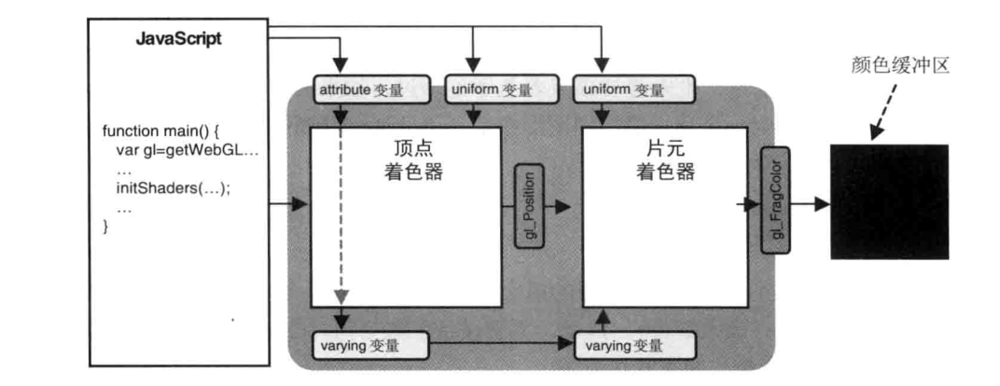
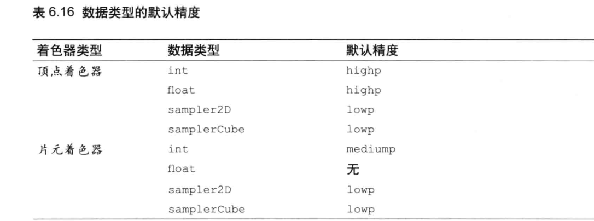

```js
着色器程序的入口函数
void main () //每个着色器只允许有一个


注意:webgl glsl es  并不支持gles es 的所有特性


glsl es 语言大小写敏感 
以;作为语句结束


注释
和c.java等高级语言的注释的使用方法一样


数据类型
    数值类型  int  float


    布尔类型  true  false


 glsl es  是一个强类型的语言
 
 

 基本类型

    float

    int 
    
    bool


将int类型 转化为 float类型


int a =1;


float b =float(a);


基本类型转换函数

    int(bool|float)


    float(bool|int)


    bool(float|int)  //0 或 0.0 转化为false


矢量和矩阵
    vec[234]  分量为浮点数类型

    ivec[234] 分量整数类型

    bvec[234]  分量布尔类型

    mat[234]  2,3,4阶的矩阵(元素都为浮点数)


赋值
    vec4 a=vec4(1.0,2.0,3.0,4.0)


当 vec4 b=vec4(1.0) //则所有分量都为1.0 (1.0,1.0,1.0,1.0)

规则 当里面的参数不够时就会用最后填充进来的参数进行填充


矩阵
  1.  mat4 a=mat4(1.0.......)
    //注意 它会先从列开始 第一列 完了，在进行第二列的排序


  2.向举证传入矢量


  3.向矩阵传入否数值大于1

  mat4 m4=mat4(1.0)
      1.0 0.0 0.0 0.0
      0.0 1.0.......
      .............
      ............1.0

      对角向为你传入的那条数据
   
 4.当传入的数 大于1 且不等与需要传入的数 就会出错


访问元素
    . [] 来访问 矢量或矩阵的值


    访问矢量的元素
        1、x y z w  //位置
        2 r g b a   //颜色
        3 s t p q // 纹理坐标分量

例 vec3 我们用 w,a,q等分量就无法访问


例 vec4 a=vec4(1.0)

a.xy  //(1.0,1.0) 
a.xyz //(1.0,1.01.0)
a.xx //(1.0,1.0)
就能分别获得 vec2 vec3 的变量
注意 我们使用连续访问他们的放量必须是同一集合的分量

a.xrgb //设个访问就是不允许的

[] 运算符

mat4_a[0] 获取矩阵第一列 也就是前4个


mat4_a[1][2]  第二列第三个元素

float m23=mat4_[2].y

[] 访问 矩阵 第一个常量代表的是列 
里面的参数必须是常量

mat2[index] //index 要想被使用必须让他变为常量   const index 进行修饰


运算符
  矢量 和矩阵的比较运算符只能使用  == 和 != 


运算符对矩阵个矢量的运算其实就是对它们的每个分量进行运算


例 1
   v3b=v3a+b
   v3b.x=v3a.x+b
   v3b.y=v3a.y+b
   v3b.z=v3a.z+b


 
 2.矢量运算
    实际就是矢量对应的分量进行运算


3.矩阵和浮点数进行运算

   运算和矢量一样发生在每个分量上面


结构体

       struct name {

       } 

       name l1,l2  //声明了 l1 l2的name结构体的变量


      struct name2 {

       } l3;  //声明的 name2结构体的l3变量

       和c语言的结构体相似


结构体的构造和赋值

    l1=结构体名(第一个属性的赋值,....);


访问结构体的成员
    类型  变量名  =结构体变量.属性名


数组
glsl es 只支持一维数组


例：
 float a[5]  //声明4个浮点元素数组

 vec4 v4_array[100] //声明 vec4 类型的数组数组长度100


数组的长度 必须是大于0 的常量表达式


注意 const 不能用来修饰数组


数组元素的访问c和语言等高级语言访问数组是一样的。


只有常量 和  uniform 修饰的变量可以用作数组索引值


取样器(纹理)

glsl es 支持一种内置类型 称为取样器(sampler)
我们必须通过该类型来访问纹理 
类型为

sampler2D ,samplerCube  注意取样器类型只能被 uniform 进行修饰

uniform sampler2D u_Sampler

//我们在js 代码通过设置取样器的编号向他赋值


gl.uniformli(U_Sampler,0);//将纹理单元0号传给着色器


程序流程控制

if if else  else if  和c 语言的语法相同

for

  只允许一个循环变量

  循环表达式必须是 i++ i-- i+=n  i-=n  n表示的常量


  for 循环内部不能进行赋值 


continue  
break 


discard 只能在片元着色器中使用   放弃当前片元的处理，处理下一个片元


函数
   返回类型   函数名 (形参){

       return 
   }


   是c语言格式的函数


注意 调用函数必须和上面的形参的个数和类型必须一致


注意 glsl 的函数不允许递归的出现


规范声明

        函数的调用 和c语言一样 必须放在调用之前或者在调用的地方进行声明


参数的限定词
(作用：控制参数的行为)
1.允许读
2.允许修改
3.允许读和修改


in 
   在函数内可以使用参数,可以修改


const in 可以使用，不允许修改


out 传入的是变量的引用  修改值会对函数外面的变量值，不能使用该值


inout  传入函数 ，函数用到的是变量的初始值，修改变量也会影响到外边的变量


函数的默认修饰符是in (值传递)


内置函数


全局变量 和局部变量

声明在函数外面的变量就叫做全局变量

在函数内部声明的变量叫做局部变量


```

### 存储限定字


```js
const变量
    该限定字 修饰的变量表示变量的值不允许改变

    也就是说不允许对const 修饰的变量进行初始化之后 不允许在进行赋值


  
  


attribute 变量

只能在顶点着色器中使用

只允许修饰
    float vec[234] mat[234]


    attribute 变量的数目与设备有
    webgl 至少支持8个 attribute的变量


 
 


 uniform 变量(只读)  变量的数目与设备相关
    两个着色器都允许使用该修饰符修饰变量

    数组和结构体不能使用
    
    
    若顶点着色器和片元着色器都定义了同名的变量
    那么他们之间的数据是被共享的


varying 变量 (顶点着色器和片元着色器之间进行数据传输的变量)


注意：两个着色器使用varying的变量名和类型必须相同


并不是直接传送给片元  是要经过一个光栅过程才进行传送(差值)


至少能声明8个变量


精度限定字
    目的：帮助着色器提高运算效率，削减内存的开支


//使用适中的默认值
#ifdef GL_ES

    precision 精度限定词  float

#endif


webgl支持三种精度

    highp 高精度 顶点着色器的最低精度

    mediump 中精度 片元着色器的最低精度


    lowp 低精度  可以表示所有颜色


片元着色器不支持 highp 最高精度


精度级别 类型  变量名


precision 默认精度  //逆序写在两个着色器的顶部


例 precision mediump float ;  所有使用float 默认使用的是中等的精度


```
### 数据类型的默认精度



```
片元着色器里面 float 为使用精度 不在片元着色器里面设置精度会报错


预处理指令
  是否定义了 xxxx 宏  
    #ifdef  xxxx 
    #endif


  #define 宏  内容  

    #undef xxx  //解除xxx宏的定义


#if 判断条件 无括号


#else


#endif


预定义宏
    GL_ES  Opengl es 2.0 定义为1


    GL_PREAGAMENT_PRECISION_HIGH  片元着色器支持 highp精度


#version  number


指定GLSLES 的版本


```