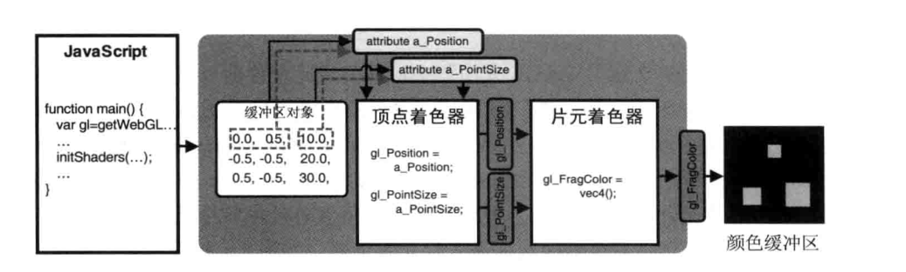
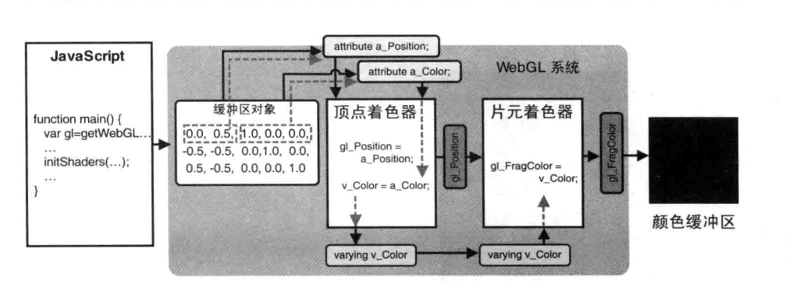
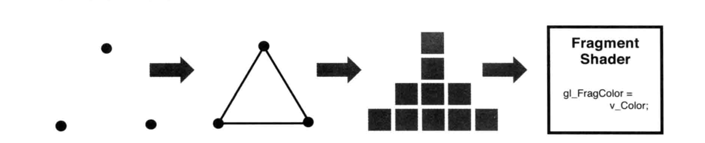
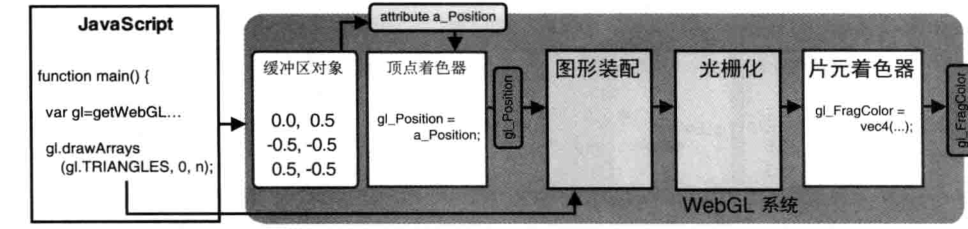
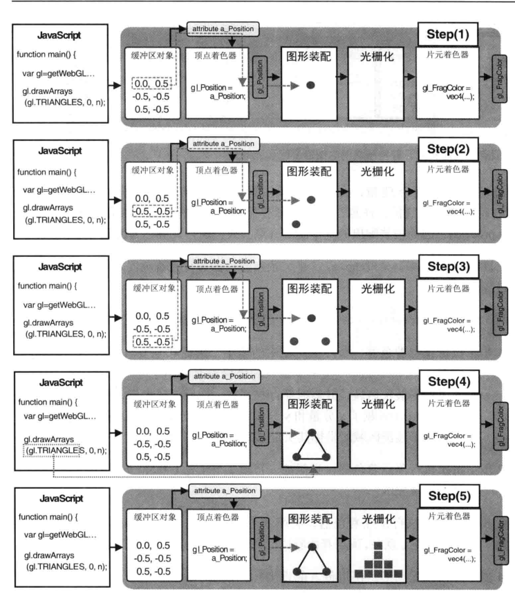
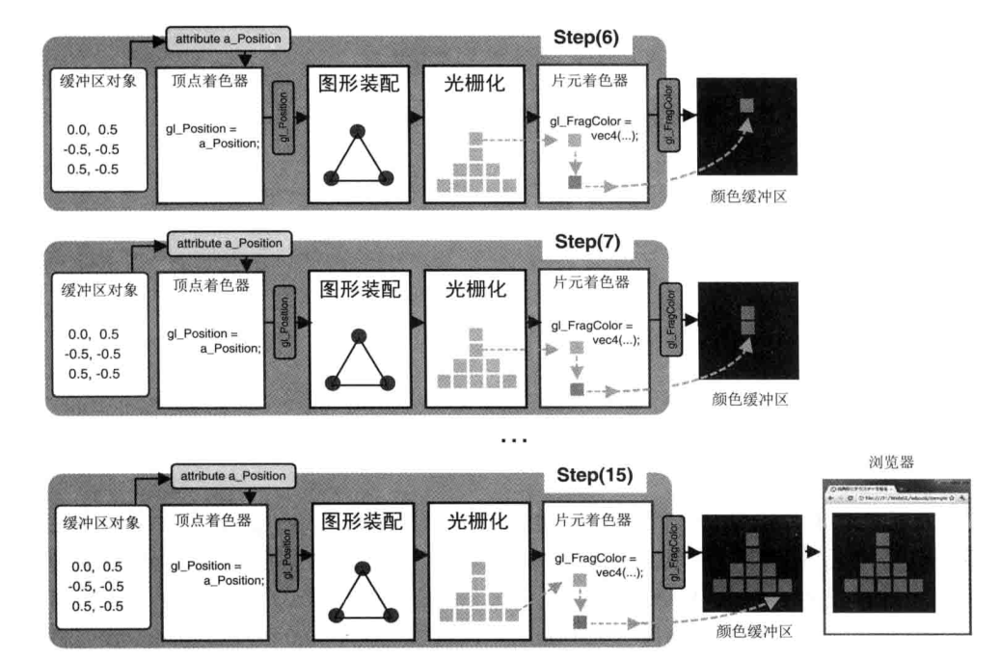
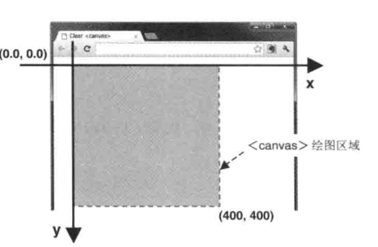
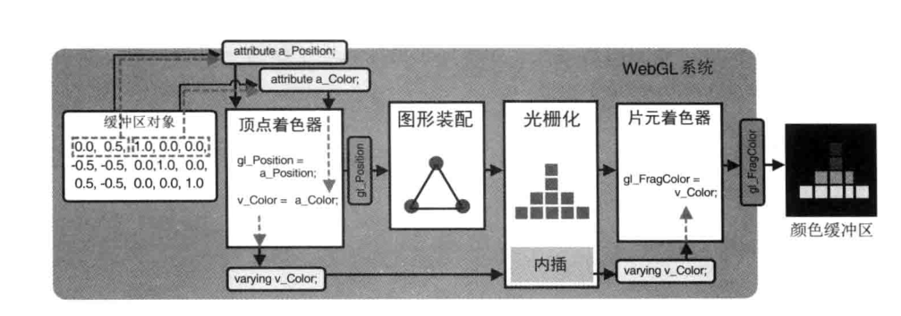
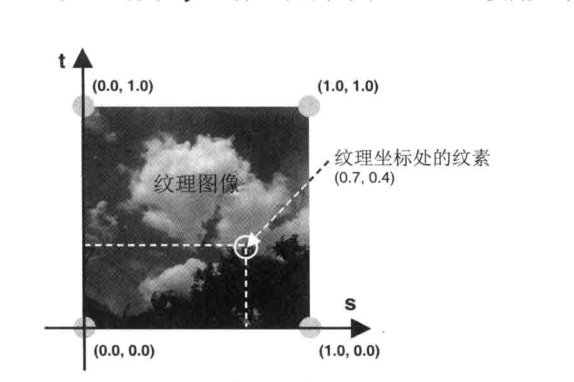

```js
顶点着色器和片元着色器的图形到片元的转化又称为光栅化


1.将非坐标数据传入顶点着色器
    一：创建多个缓冲区的方式(适用于数据量不大的运用场景)
    如何在缓冲区数据传入顶点的多种数据并且使用
        1.在创建一个缓冲区
            let buffer=gl.createBuffer();
            let datas=new Float32Array([10.0,22.0,33.0]);
        2.在进行缓冲区数据的绑定

            gl.bindBuffer(gl.BUFFER_ARRAY,buffer);//BUFFER_ARRAY顶点缓冲区

            gl.bufferData(gl.ARRAY_BUFFER,datas,gl.STATIC_DRAW);

        3.获取程序里面的f_point_size 的attribute修饰的属性的地址
            //获取attribute属性的地址
            let pos_size=gl.getAttribLocation(gl.program,'f_point_size')
        4.将缓冲区分配给对应的attribute的属性
           gl.vertexAttribPointer(pos_size,1,gl.FLOAT,false,0,0)
        5.开启attribute的属性
           gl.enable.vertexAttribArray(pos_size)
      


      vertexAttribPointer()的步进和偏移参数

   二：将多种数据全部放在一个缓冲区
            运用 vertexAttribPointer() 里面的 stride (第5个参数) 和offset(第6个参数)进行设置
         
         stride：相邻两个顶点的默认字节数   (这里叫做步进参数) 单个顶点所有参数包含的大小


         offset: 缓冲区的偏移量(以字节为单位) 表示数据项距离首个元素的距离
  Float32Array.BYTES_PER_ELEMENT //每个元素的字节数


```



```js
varying变量 (只能是 float 以及相关 的vec[234] mat[234] )

顶点着色器和片元着色器之间的参数进行交流


uniform 可以使用但是不能够改变数值也就是有多个像素就需要多个变量而且两个着色器不能够进行数据的交流


```
### varying两个着色器传输数据图示



### 流程图


```js

rgba颜色分量值为0.0-1.0 之间


我们只传入三个颜色的参数为什么会造成三种颜色的平滑过渡？？？

几何形状的装配和光栅化
    我们绘制三角形-->创建了缓冲区-->并向缓冲区里面放了三个顶点的位置值(xy)


上图流程图顶点着色器--到片元着色器的流程

图元 基本图形  (点，线，面)
1.图形装配过程
    有gl.drawArrays() 的第一个参数 type决定 将孤立的的顶点装配成几何图形
2.光栅化过程 将装配好的图形转换成片元


gl.drawArray(type,count) count 设置为3

    1.将第一点进行赋值 gl_Position 
    把这个放在图形装配区域进行暂存

    2.第二个点也是

    3.第三个点存入装配区 已经执行了存入的count的次数

    4.拿着我们三个点然后获取type类型，根据类型进行装配

    4.我们的屏幕是像素组成，还需要将我们构成的图元进行光栅化构成片元(x像素)
```
### 流程图



```js
图元光栅化后构成的片元的数目就是包含像素的数目
```

## 调用片元着色器

```
光栅化完成后-->逐个片元调用片元着色器

对于每个片元在计算出片元的颜色，并写入颜色缓冲区
当所有片元颜色存入缓冲区，在浏览器会显示最终的结果


片元着色器的内置属性
gl_FragCoord 类型 vec4
内置变量的分量  1 ,2 表示canvas 坐标系统的坐标值(gl.FragCoord.x,gl.FragCoord.y)


注意 canvas的坐标系是左上角为(0,0)

```
### Canvas坐标图示



```js
注意 canvas.y  越下越大


```


### varying 变量的作用和内插过程

```js
我们在顶点着色器进行赋值-->他会把值传给片元着色器厅类型同名的变量
注意  片元  着色器  varying 修的同类型和同名的属性


在赋值给片元着色器之前 做了差值的处理(内插过程)


```

### varying变量的内插过程




```js

也是说我们在varying 变量中实际值设置了三个点的颜色
而三角形其他的像素点的颜色都是内插出来的


例 我们要画同一条线段

a,b两个点 在图形装配成线段并且进行光栅化求出全部的像素

我们在顶点做色器 对 a ,b两个点 的varying变量进行赋值，但是

其他的像素的颜色值是内插出来的


颜色的内插


在矩形的表面贴上图片
    就是将 一张图像贴到一个由两个三角形组成的矩形上。
    这张图片就叫做纹理或叫做问题的图像
    
    纹理映射:根据纹理的图像，为之前光栅化的每个片元涂上合适的颜色，组成纹理图像的像素被称为纹素(rgb或rgba进行编码)


 
 在webgl中纹理映射遵循的步骤
        1.准备好纹理图像
        2.为几何图像配置纹理的映射方式
            片元 和 图素 怎样 进行 映射
        3.加载纹理的图像 并对其进行一些配置
        4.在片元着色器将纹素的颜色抽取出来，并且把它赋值给片元


纹理坐标 (一套新的坐标系统)
 通过纹理坐标可以获取纹素的颜色


```

### 纹理坐标



```js


```