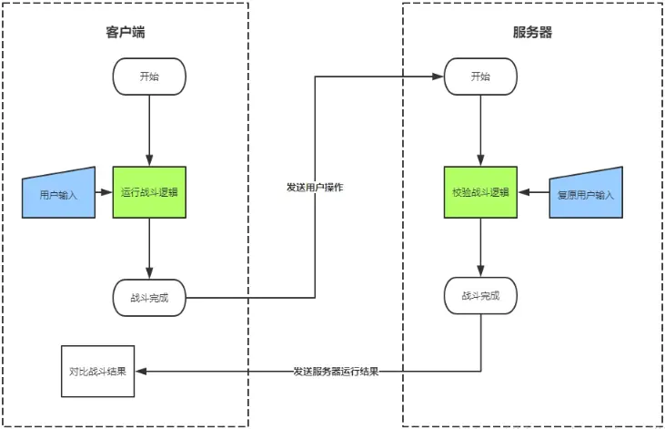

```
实现多个客户端之间不同状态的同步从而实现联机

技术方向
  状态同步
  帧同步


状态同步
   client-->发送游戏状态到--server-->计算--广播发送给client

   clent 起到的作用只是显示  计算任务都在服务器上面进行完成

 若全部在服务器上进行运算 其实是不太行的 
   1.上传的数据量巨大  会造成服务器带宽网速的压力 增加成本
   2.服务器计算任务太多 可能会造成延迟
  
  为了体验更加 选择 减少 数据上传 一部分不重要的计算 在客户端进行完成


这种在延迟性要求不高的游戏可行(RPG)，但是在即时战斗的游戏中这种方式的同步方式就不行了


帧同步解决了即时战斗的延迟性问题
帧同步其实同步的是玩家操作的指令

简单来说  客户端--操作之后 -->操作指令发送到服务器-->服务器接收消息汇总-->转发给其他所有的客户端-->客户端接收到消息进行运算执行 


那些游戏种类需要运用帧同步？？？
1.多人实时战斗
2.回放战斗功能
3.加速
4. 服务器的同步逻辑做校验


```
帧同步图

```
1.同步随机种子：游戏中设计随机数的使用，通过同步随机数种子可以保持随机数的一致性

2.客户端上传操作指令给服务器，操作指令包含游戏操作和当前帧索引

3.游戏广播所有客户端的操作，如果没有操作也要广播空指令来驱动游戏帧前进

```