#### 概念
```
线程如何通信？？？

    共享内存的并发模型(java采用的类型)
        线程共享内存的公共状态 ，通过读写内存里面的公共状态进行隐式的通信


    消息传递的并发模型 
        因为没有共享程序，所以只能线程之间发送消息显示的进行通讯    

线程之间如果同步(并发执行)???
    同步：用于控制不同线程间发生的相对顺序。

```


#### java内存模型的抽象结构


```
java中实例，静态 ，数组元素 都存储在堆里面


堆内存在线程之间是共享的


局部变量 和 形参 和 异常处理的参数 存在 栈里面 他们在线程之间是不共享的


java线程之间的通信是由java内存模型决定的(JMM)


JMM决定一个线程的写入对另一个线程何时可见  线程之间的共享存储在主内存中(Main Memory)


每个线程都有一个私有的本地内存，读写内存存储着线程以读写内存变量的副本（本地内存是JMM的一个抽象的概念）
    本地内存：缓存，写缓存，寄存器和其他硬件和编译器的优化


```

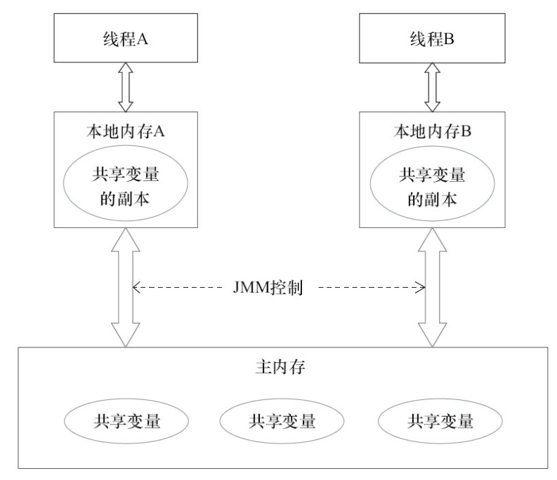

```
由上图可以知道每个线程存在一个相同的共享内存模型

    两个线程之间的通信过程
            A 的的内存写入新数据--->把A的数据刷新到主内存里面

            B 线程到主内存里面读取A已经更新的数据并且把它写到 自己的副本上


总结 上面可知 JMM 模型中 两个线程之间的通信实际上是经过 主内存 这个介质进行线程之间的数据传递(来保证数据之间的可见性)

```


#### 从源代码到指令序列的重排序
```
为什么要进行指令的重排序???
   为了提高性能，编译器对指令的优化


重排序分为3类
    1.编译器优化的重排序：在不改变语义的情况下，编译器重新安排语句的执行的顺序。
    2.指令级并行的重排序：（现代的处理器允许指令的并行技术--将多条重叠执行）若不存在数据的依赖处理器将改变语句对应的机器码执行的顺序

    3.内存系统的重排序：处理器使用缓存 （对缓冲区的读写），（使得加载和存储的操作看上去是乱序的）


```

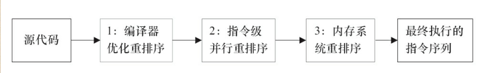
```

上面的这些重排序操作可能会对内存的可见性造成影响

jmm编译器 的重排序 有一些特定的类型是不允许重排序的

jmm 处理器的重排序 java编译器在生成字节码序列的时候，插入特定类型的内存屏障(intel 里面是 memory fence 指令)
    插入这些内存屏障：禁止这些特定的类型的处理器进行重排序


jmm 属于语言级别的内存模型，他能确保在不同的处理器和编译器至间为程序员提供统一的保证性


```


#### 并发编程模型的分类

```
cpu缓存的优点
现代处理器写缓存【临时】保存写入数据,写缓存保证指令流水线的持续运行(避免由于处理器停顿下来等待写入内存数据产生的延迟)，同时通过【批处理的方式】刷新写缓冲区，合并写缓冲对同一地址的多次写，(减少内存访问对总线的占用次数)

cpu缓存的缺点
    写缓存值对当前cpu是可见的。(会对内存的操作执行的顺序产生影响)
       因为cpu对内存的读写顺序，不一定和实际的内存顺序一致（cpu缓存造成的原因）


```
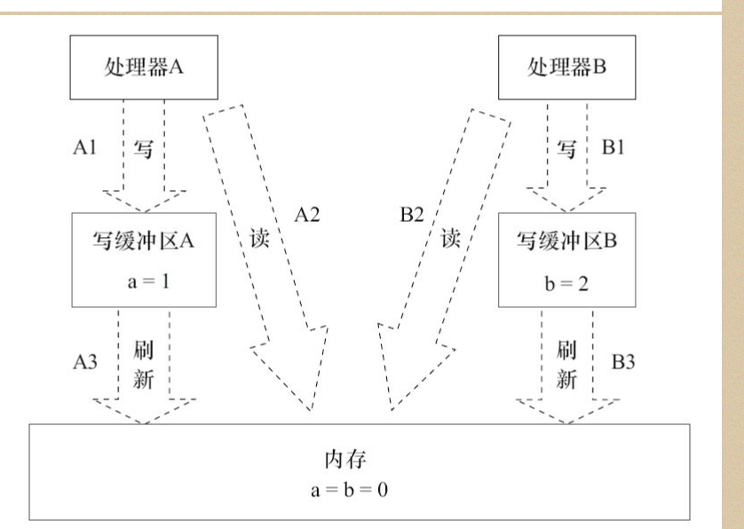
```
A B 线程 分别读取

我们指令的顺序为 A1-A2-A3

A1 缓存的写入并没有写入内存  
A1-A2 执行顺序 在cpu中可能 A2(读取内存)-1A

```

常见处理器重排序的规则
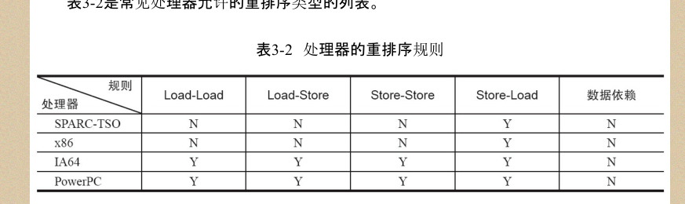
```
上图

N:表示不允许两个操作重排序
Y:表示允许


所有的处理器都允许 Store-load 进行重排序
数据依赖：所有cpu都不允许重排序

上图的x86 包括 x64和amd64
```


### jMM 解决处理器的指令重排

```
为了保证内存的可见性java编译器生成指令顺序的时候会在适当的位置插入内存屏障指令禁止特定类型的处理器重排序

JMM把屏障指令分为4类
```
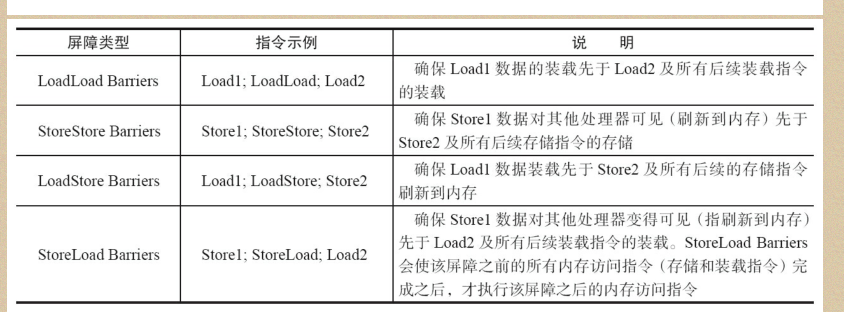

```

最后的StoreLoad Barriers 全能型屏障，同时具有上面三个屏障的效果(现代处理器大多支持该屏障)--其他的屏障不是每个处理器都是支持的。

Store-Load 屏障的开销非常的大(他会把写如缓存的全部数据-->全部刷入到内存)

```


#### happens-before简介
```
jsr-33 java mm 

两个线程之间内存可见必须存在 happens-before关系


happens-before 仅仅要求前一个操作对后一个操作是可见的


```

Happens-before和JMM的关系

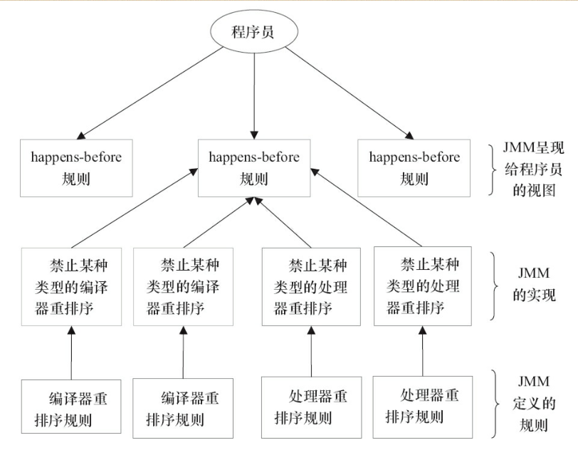


#### 重排序
```
编译器和处理器为了优化程序性能而对指令进行重排序的一种手段
```


#### 数据依赖性

```
定义：两个对同一个变量的操作，并且两个操作中有一个未写操作，那么这两个操作之间存在着数据的依赖性

```

数据依赖性的情况

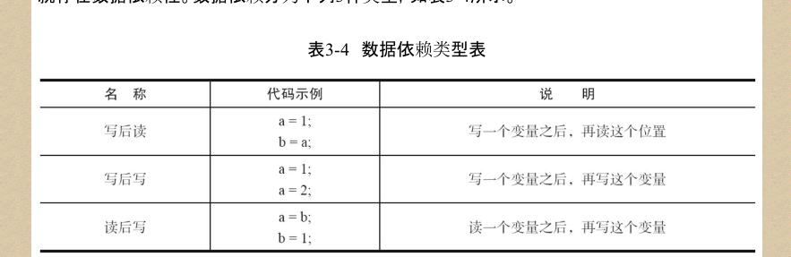
```
    上面三种情况只要进行重排序，数据的结果就会发生改变

处理器和编译器都有可能对操作进行重排序，他们会遵循数据的依赖性(他们不会改变数据性关系)
也就是说有上面图片的三种关系的一种就不会进行重排序(只针对单个线程)


```


#### as-if-serial 

```
as-if-serial :编译器和处理器不管怎样重排序都不能改变最终的结果


double pi = 3.14; // A 读
double r = 1.0; // B  读
double area = pi * r * r; // C  写


A-C  B-C  写读 是有依赖关系的

A-B  不存在依赖关系 因为不是对同一个变量进行操作


所以有两种方式进行重排序

A-B-C

B-A-C


这种重排序的问题在单线程程序中不受影响的
```


#### 程序的顺序规则
```
double pi = 3.14; // A 读
double r = 1.0; // B  读
double area = pi * r * r; // C  写

这程序有三个 happens-before规则

A happens-before B
B happens-before C
A happens-before C


注意： cpu 和编译器不会对有依赖关系的指令进行重排序


根据重排 B 有可能 在A之前 执行  
但是 A happens-before B 并不要求 A 执行先于B 而是 A的结果对B可见

A-B B-A jmm认为这种排序并不违法 允许这种排序

```


#### 重排序对多线程的影响
```java
class ReorderExample {
    int a = 0;
    boolean flag = false;
    public void writer() {
        a = 1; // 1
        flag = true; // 2
    }
    Public void reader() {
        if (flag) { // 3
        int i = a * a; // 4
        ……
        }
    }
}


A和B两个线程 分别执行程序  A-->writer()

随后  B-->render() 方法
      B线程在执行 render()的时候能否看到 a=1


B 不一定看到 a=1
   1,2两个操作没有依赖关系(不是对两个相同参数进行操作和没有包含一个写) 编译器和处理器可能进行重排序  2可能先执行与1


```

上面程序重排序可能造成的错误 1 2重排序错误
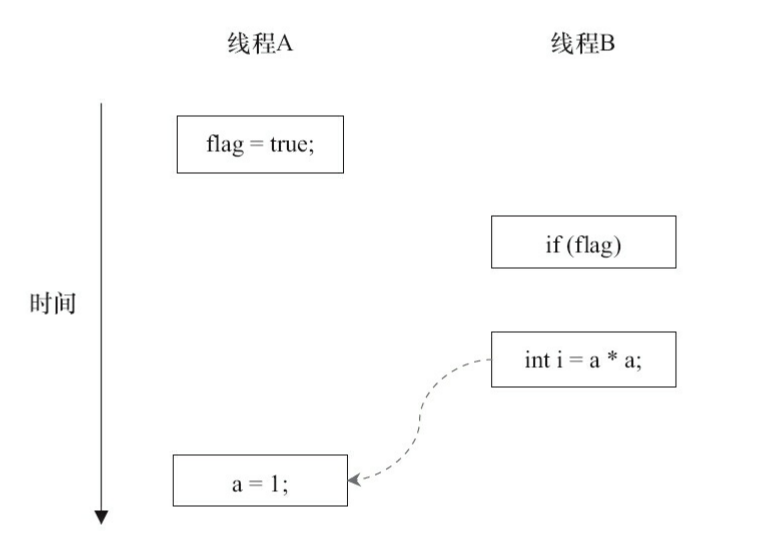
//上面的虚线表示错误的读操作


<br>

34 重排序错误

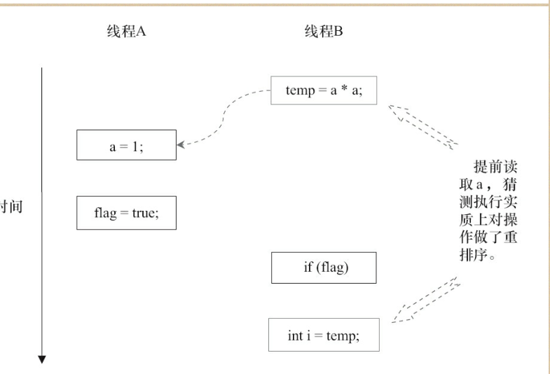

```

上图若34 出现重排序


当代中存控制依赖性时，会影响执行的并行度，编译器和处理器会采取猜测(预估)来克服相关性并行度的影响。

当执行线程B时候可以提前先读取并计算 a*a,然后把结果临时保存到重排缓冲（rob）中 当3的条件为真 就世界吧值写入i中


单线程 遵守 as-if-serial 允许重排序 最终结果不影响，多线程允许重排就会改变程序的执行结果


```


#### 顺序一致性
```
 数据竞争的定义:
    javamm 内存模型对数据竞争的定义
        一个线程在写一个变量，
        另一个线程在读同一个变量
    两个线程没有进行排序操作，是同步进行操作的


### 顺序一致性的内存模型

两大特性：
    1、一个线程中的所有操作都必须按照程序的顺序来执行
    2、(不管程序是否同步) 所有线程都只能看到一个单一的执行顺序，每个操作中都必须原子执行对所有线程可见。


```

内存一致性图
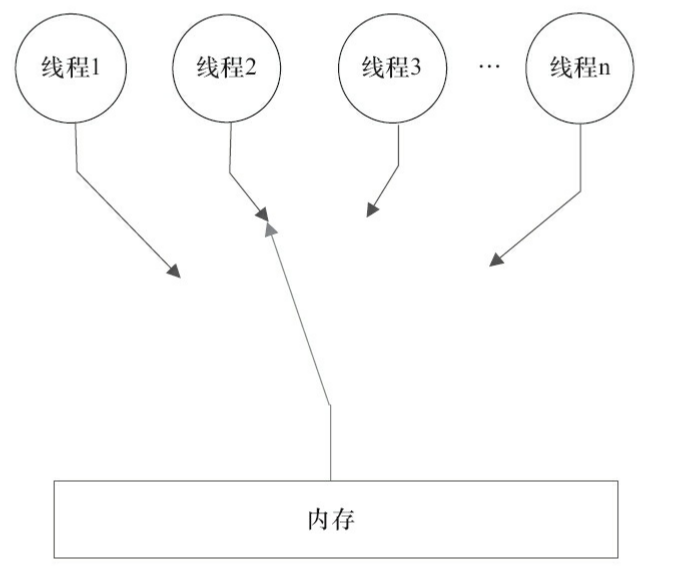

```
上图中内存就是代表带线程间的共享参数的内存

上面就好像开关，每一个线程按照顺序对共享的参数进行访问 ，
该那个线程访问，name内存的那根线就与上面链接，其他的则不能对这个共享的内存区域进行访问


```


两种方式保证顺序一致性

方式一


```
第一个线程执行完，第二线程在执行


```

方式二
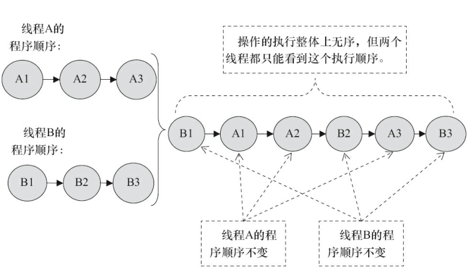

```
无序交错执行
但是每个操作他们的操作必须对每个线程可见
```

```
但是JMM 并没有保证多个线程中的每个操作必须在其他线程的操作可见


```


#### 未同步程序的执行特征
```
jmm 保证线程读取到的值不会无中生有(提供最小的安全性)

jvm 在堆上分配对象(jvm实现最小的安全性)
    1.先将内存空间进行清零
    2.然后在会分配给对象(jvm 会同步这两个操作)


比较
1.顺序一致性模型 指令的顺序不变按顺序执行
hmm 模型 在单线程 和多线程(同步块中)，支持指令的重排优化保证最终结果一致性

2.jmm 不保证 64位的long double类型原子性，顺序一致性保证
    处理器和数据之间的数据传递的步骤叫做总线事务

    读事务：内存传递数据到处理器

    写事务  cpu 传数据到内存


    每个事务会读或写内存中的一个或多个物理上的连续的几个字

    关键：总线会同步试图并发使用总线事务，处理器执行总线事务期间，总线会禁止加他处理器和io设备执行内存的读写


当ABC线程同时发起总线事务，这时总线仲裁会对竞争做出决裁，假设A在这次决裁中获胜(总线保证每个线程能公平的访问内存)，A继续行驶他的事务，BC两个线程等待。


总线的工作机制把多核的程序限制成串行的访问方式使用(保证单个总线访问内存的原子性--执行读写事务)


当我们在32位的操作系统上面使用 64位的long ....开销比较大,为了照顾着个处理器(32位) jvm 语言规范但是鼓励但是不强求对64位的long和double型的变量具有原子性

在32位的cpu中可能会把64位的类型的分为两个操作并且进行两个总线事务的操作，此时的64位就不具有原子性


```
总线事务执行的图序

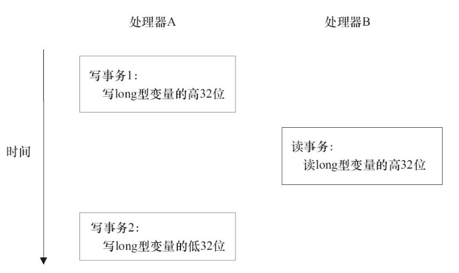

```


注意：
    jsr-133(旧内存模型 jdk1.5)之前可以拆分分为两个32位分别执行读写操作

    jdk1.5 开始 只允许才分为两个32位执行写操作

    任意的读操作都必须有原子性(z在单个总线事务中执行)
    
```


