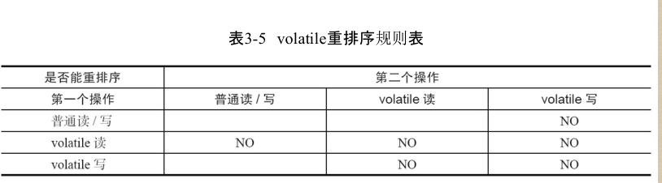
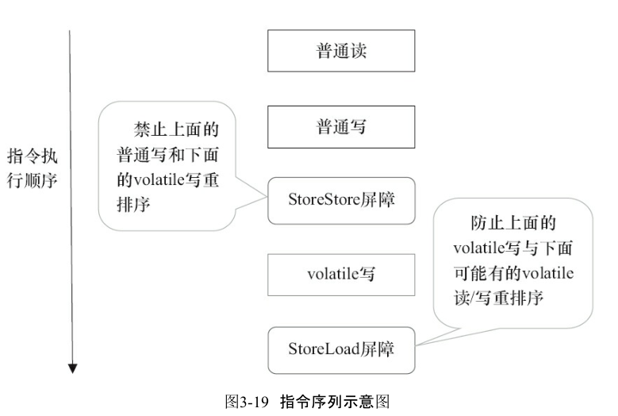
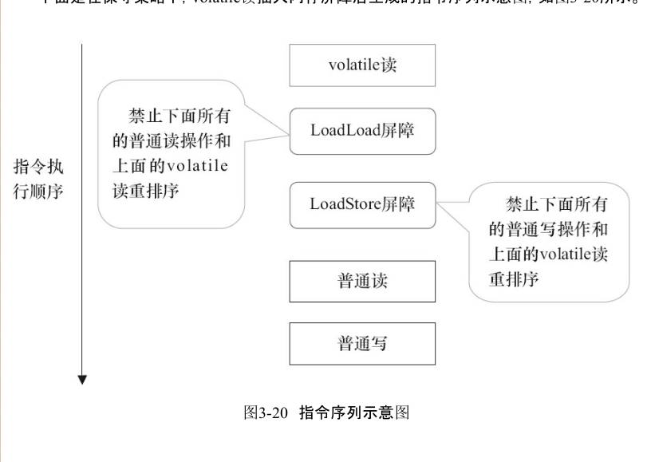

### volatile的内存语义
```
### 特性
    把用volatile修饰的变量看成是一个使用同一个锁对这些单个读写操作做了同步


 锁 happens-before 规则 保证释放锁和获取锁之间的可见性   

 volatile 和 普通锁都是cas 使用 lock指令


 单挑对volatile 变量的操作具有原子性(读写) 保证在读写时其他变量不能操作通过总线操作任何东西

 但是 a++ 这样的操作没有原子性
  a++
  就是  b= a 先读a变量
        a=b+1 在写

        这里的两条指令之间不是原子性的 但是他们的每一条指令但拎出来是具有原子性的
```


### volatile 写 - 读 的内存的语义

```
当写一个volatile变量时 jmm 会把线程对应的【本地内存中的共享变量值刷新到主内存】


读 flag 变量后 flag地址已经无效 b到内存重新读取共享变量到本地内存


总结  volatile 写变量 之前的可见共享变量 在另一个 读 volatile变量之后也可见


```


#### volatile 语义的实现
```
为了实现 volatile 语义，jmm限制编译器重排序和 处理器重排序

```

重排序表


```

实现volatile语义 编译器在字节码里面插入内存屏障，来禁止处理器的重排序

jmm基于保守策略的内存屏障插入策略
    StoreStore屏障
    volatile 写操作
    StoreLoad屏障

    LoadLoad屏障
    volatile读操作
    LoadStore屏障


```


```
上图可知 StoreStore 前面的普通写的共享变量其实其实对其他线程已经可见了
StoreStore 屏障已经将前面的的本地数据全部刷新到内存


然而 后面的 StoreLoad 屏障的作用是避免与后面的读操作处理器进行重排序

StoreStore屏障
   禁止上面的写操作和volatile 写操作进行重排序

StoreLoad 屏障
    禁止上面的volatile 写 与下面的volatile读写进行重排序

jmm 实现特点 ：首先保证正确性，在保证正确性的条件下追求性能

```
volatile插入的内存屏障



```

LoadLoad 屏障
    禁止下面所有读操作 和上面的volatile读重排序

LoadStore 屏障
    禁止下面所有的普通写操作和这个读操作进行重排序

```

#### JSR-133 为什么要增强volatile的语义
```
    jsr-133 (旧模型 1.5<) 允许volatile变量和普通变量之间重定义

    >1.5 不允许重排序

    
```