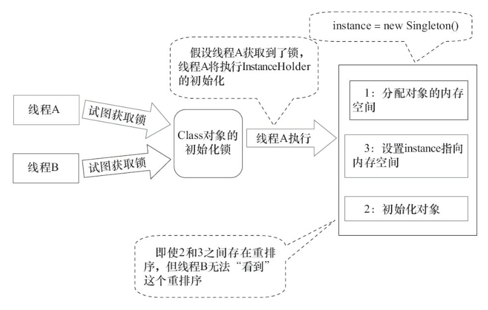
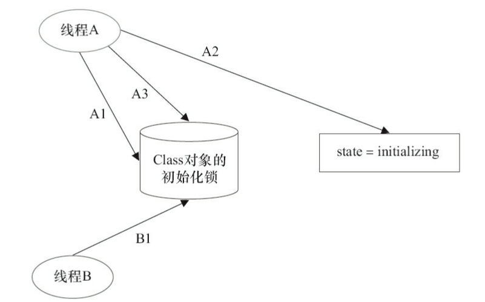

```java
public class DoubleCheckedLocking { // 1
private static Instance instance; // 2
public static Instance getInstance() { // 3
    if (instance == null) { // 4:第一次检查
        synchronized (DoubleCheckedLocking.class) { // 5:加锁
            if (instance == null) // 6:第二次检查
            instance = new Instance(); // 7:问题的根源出在这里
            } // 8
        } // 9
        return instance; // 10
    } // 11
}

这个重建检测确实比直接在方法上加锁和加一层锁性能有所提高

但是 当线程A 执行步骤7 但是 还未初始化完全
线程B 执行执行4步 !=null  返回的是未初始化完全的对象


```


### 问题的根源在于
```java
 instance = new Instance(); // 7:问题的根源出在这里

 其实是分成了三个步骤

memory = allocate();　　// 1：分配对象的内存空间
ctorInstance(memory);　// 2：初始化对象
instance = memory;　　// 3：设置instance指向刚分配的内存地址


在一些jit 上面 2，3步骤可能进行重排序 先复制地址，在进行初始化对象

例：进行了重排序
memory = allocate();　　// 1：分配对象的内存空间
instance = memory;　　// 3：设置instance指向刚分配的内存地址
// 注意，此时对象还没有被初始化！
ctorInstance(memory);　// 2：初始化对象


java语言规范 重排序不影响单线程执行的结果，上面的代码重排序确实也是没有影响单线程的结果

但是在多线程执行中是不保证的

```


### 解决方法


#### 基于volatile 实现
```java

public class SafeDoubleCheckedLocking {
    private volatile static Instance instance;
    public static Instance getInstance() {
        if (instance == null) {
        synchronized (SafeDoubleCheckedLocking.class) {
            if (instance == null)
            instance = new Instance(); // instance为volatile，现在没问题了
            }
        }
        return instance;
    }
}


注意　这个解决方案需要JDK 5或更高版本（因为从JDK 5开始使用新的JSR-133内存模
型规范，这个规范增强了volatile的语义）


volatile 修饰其实就是不要让他们进行重排序 来保证延迟的初始化

```


#### 基于类初始化的解决方案
```java
jvm 在类初始化阶段(即在Class被加载后，且在被线程使用之前)会执行类的初始化期间，jvm 会去获取一个锁，这个锁可以同步多个线程，对同一个类进行初始化


public class InstanceFactory {
    private static class InstanceHolder {
        public static Instance instance = new Instance();
    }
    public static Instance getInstance() {
        return InstanceHolder.instance ;　　// 这里将导致InstanceHolder类被初始化
    }
}


```



```
类的初始化(静态初始化和类中的静态字段)，根据java规范首次发生下列一种情况，一个类或接口类型T将被立即初始化

1.T是一个类，而且一个T类型的实例被创建

2.T是一个类，且T中声明的一个静态方法被调用。

3.3）T中声明的一个静态字段被赋值。

4.T中声明的一个静态字段被使用，而且这个字段不是一个常量字段。

5.T是一个顶级类（Top Level Class，见Java语言规范的§7.6），而且一个断言语句嵌套在T
内部被执行。


由于Java语言是多线程的，多个线程可能在同一时间尝试去初始化同一个类或接口（比如
这里多个线程可能在同一时刻调用getInstance()方法来初始化InstanceHolder类）。因此，在Java
中初始化一个类或者接口时，需要做细致的同步处理。


```

#### 类的初始化过程(认为的分为5个阶段)
```
1.Class对象的同步(获取Class对象的初始化锁)
    控制类，节后的初始化，获取锁的过程已知等待，知道获取这个初始化锁


```


```java
###类初始化的第一个阶段

时间                线程a                            线程b

t1           a1线程尝试获取Class对象的初始化锁     b1也尝试获取Class
             假设 a1获取到了锁                    对象的锁，未获得   


t2        线程a看到线程还未被初始化（
           读取状态为state=noinitiation ）,
        线程设置状态为 initializing (正在初始化)


t3    线程a释放初始化锁


```


```
第二阶段
  线程A执行类的初始化，同时贤臣B在初始化锁对应的condition上等待（b也是initializing 状态）


第3阶段：线程A设置state=initialized，然后唤醒在condition中等待的所有线程。  


第4阶段：线程B结束类的初始化处理。


```
