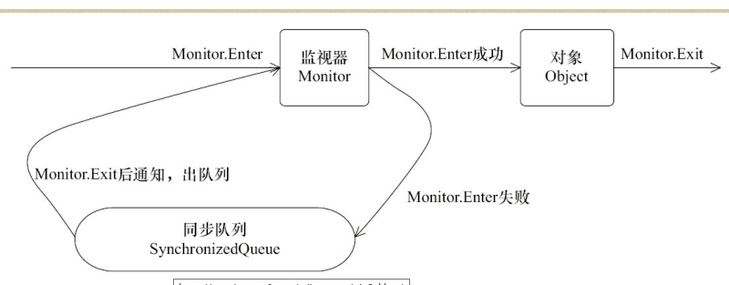
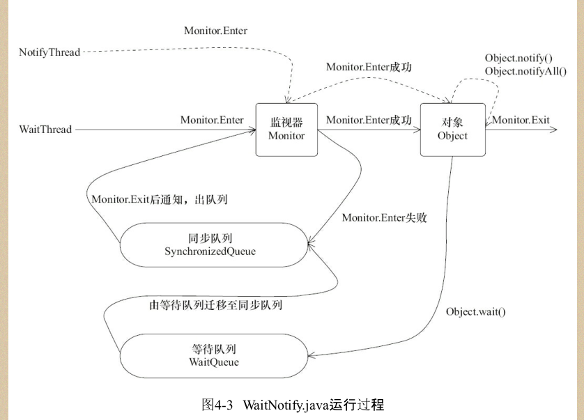

## 线程间通信

#### volatile 和 synchronized
```java
synchronized
    4: monitorenter  //监视器进入获取锁
    5: aload_1
    6: monitorexit  //监视器退出释放锁


  public static synchronized void m();
    descriptor: ()V
    flags: ACC_PUBLIC, ACC_STATIC, ACC_SYNCHRONIZED

 flags: ACC_PUBLIC, ACC_STATIC, ACC_SYNCHRONIZED 方法的修饰表示public static synchronized


任意一个对象都有自己的的监视器-->当一个对象由同步块或者这个对象的同步方法调用时-->执行方法的线程必须先获取对象的监视器才能进入同步块，或方法
未获得监视器的线程将被阻塞在同步块或方法的门口


```



```

上图知
1.先获取Object监视器 Monitor
   if(!是否获取Obhject监视器){
       //未获取监视器
       进入到 sync queue 阻塞等待 blocking
   }else{
       //获取监视器
   }

 2.当释放了锁之后，释放操作唤醒阻塞队列，重新对监视器的获取  
```


### 等待/通知机制
```
notify(): 通知一个等待的线程 等待线程 执行 wait() ,返回前提是改线程获取到了锁

notifyAll() 通知所以等待在改对象的线程


wait()  进入 waiting状态，会释放锁

wait(long) 等待 long 毫秒 在时间段范围内没有通知就返回超时


wait(long,int)  纳秒


、


notify()方法将等待队列中的一个等待线程从等待队列中移到同步队列中，而notifyAll()
方法则是将等待队列中所有的线程全部移到同步队列，被移动的线程状态由WAITING变为
BLOCKED


注意 调用 notify()  或者调用 notifyAll() 之后wait () 方法不会立即返回 ，wait()方法执行的地方会等待执行notify()...等的方法执行完释放锁，并且重新进行锁的竞争，获取到了锁才会继续执行


```



#### 等待或通知的经典范式

```
消费者

synchronized(lock){
    while(不满足条件){
        lock.wait();
    }
    对应的处理逻辑
}


生产者


synchronized(lock){
   //改变条件

   lock.notifyAll();
}


使用对象wait() notify  等方法 需要先对该对象进行加锁

```


### 管道的输入输出流