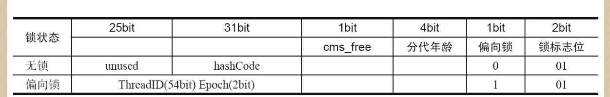

## java对象头
```
在java虚拟机中 
    32位 1 word 4 byte

    非数组 用两个字(world)宽度存储对象头 8 byte

    数组 用3个字(world) 存储对象头 12 byte

 对象头包含
 1.mark world  32/64 bit  存储hashcode 或锁的相关的信息
 2.class metadata Address  对象类型数据的指针
 3. array length 数组的长度(当前对象是数组)


```


### Mark Word

```
mark word 总共占有对象的前 8个 byte (64 bits)

记录的信息有 hashcode (调用了HashCode()方法才会存储到markword里面),分代年龄，锁标记位


```

32位MarkWord对象存储的信息(无锁状态下)


锁markword的图


```
Mark Word里面的存储的数据会随着锁的标志位的变化而变化


        ........   1bit(是否是偏向锁) 2bits(锁的标志位)
无锁状态             0                         01        
轻量级锁              0                        00       
偏向锁                 1                       01

重量级锁               0                       10             


GC标记                 0                      11


```


### 64位MarkWord结构

```
后面三位和32位一样标记锁的等级


```


