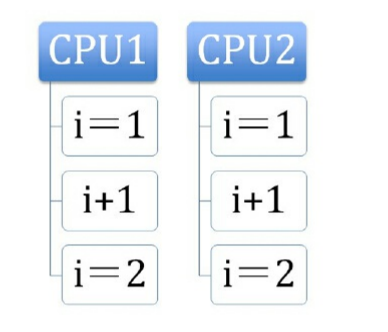

#### 处理器如何实现原子操作
```
原子性 atomic 不能分割，不能被中断的一个或一系列操作

两种方式实现多处理器之间的原子操作
    1.缓存加锁
    2.总线加锁

1.保证基本内存操作的原子性
  首先保证 内存-读|写 如一个字节是原子的

  奔腾6和现在最新的处理器能自动保证单处理器对同一缓存里进行16/32/64位的操作(读写)是原子的(也就是说每个操作在当前这个处理器里面不会被切换中断，只能被这个操作执行完或者还未执行才能才能被中断或切换)


处理器本省复杂的内存操作(跨多级缓存访问，跨多页操作缓存....)是不保证原子性的

处理器提供了总线锁定和缓存锁定两种机制来保证复杂内存操作的原子性


```


#### 总线锁定保证原子性

```
在多和处理器中
若 i 是共享的参数
对共享内存 i参数进行 i++操作

```



```
有上图可知本来在我们期望的值是3
但是最终的结果却是2


造成这个的原因可能
    在多个cpu中 每个cpu有各自的缓存(L1,L2 不进行共享)
    他门分别从内存(或者L3缓存 这个缓存是共享缓存)里面那数据然后放进的缓存(这时他们获取的值都是一样的) 他们当指令  mov ax,xxx 的时候是到自己的缓存里面拿取（两个核心都是拿自己缓存里面的值）然后在 add 操作
    在 mov [],ax写进去 这就是为什么这两个线程都写的是2


但是使用了cpu 提供的总线的锁之后 lock # 信号
其他cpu的请求将会被阻塞，当前线程独享内存


```


#### 使用缓存锁来保证原子性
```
我们只需要保证对某个内存地址的操作是原子性即可。

相比于总线锁的把总线锁住让其他cpu在锁定期间不能操作任意的内存地址来说开销要小很多


目前处理器在某些场合使用缓存锁来代替总线锁


频繁使用的内存会被缓存到 L1 L2 L3里面

缓存锁:内存区域如果被缓存在处理器的缓存中 并且在lock 期间被锁定 ，那么当他执行写入内存的操作时，处理器【不】在总线上声言#LOCK信号，而是修改内部的内存地址，并允许他使用缓存一致性保存原子性，
【缓存一致性的机制会阻止同时修改两个以上的处理器的缓存的内存区域】当其他处理器会写以被锁定的缓存行的数据是，会使缓存行无效，

```

#### 有两种情况处理器不会使用缓存锁定

```
1.操作的数据不再缓存里面(要访问数据直接到内存里面获取)，或操作的数据跨多个缓存行(cache line)


2.处理器本来不知处缓存锁定


缓存锁定和总线锁定都是使用  lock 汇编指令来实现

```


## java如何实现原子操作

```
锁或cas 操作来实现原子操作


### cas 实现原子操作的三大问题
    1.ABA 问题
    2.循环长，开销大
    3.只能保证一个共享变量的原子操作

    
```