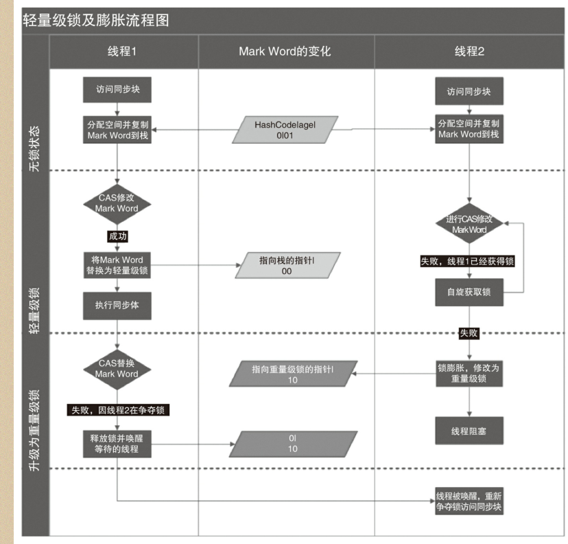

## 锁的升级与对比
```
jse 1.6 引入偏向锁 和  轻量级锁

锁的级别        markword标记
    1.无锁状态 001
    2.偏向锁   101 
    3.轻量级锁  000
    4.重量级锁  010


上面锁的级别 低-->高

锁的级别的提升是随着线程之间的竞争而升级
但是锁的级别状态是没有 降级的

```


#### 偏向锁


```js
为什么要引入偏向锁？
    HotSpot(oracle jvm) 作者发现大多数情况下锁不仅不存在多线程的竞争，而是由同一个线程多次获得，为了让锁的获取代价更低所有引入了偏向锁。

### 偏向锁的竞争

线程访问同步代码块并且获取锁，同时会在Mark Word 记录获取锁的线程的id ,和栈中(当前cpu 线程 的栈)锁的记录存储偏性的线程的id

以后该线程进入同步代码块不需要进行cas操作来加锁和解锁(会判断对象头里面是否存在当前线程的偏向锁)
   判断执行流程 (mark word 里面是否存储着当前线程的id)
    存在：
        那就表明该线程已经获得锁
    不存在：
        1.先检查mark word 中的偏向锁是否已经设置1(判断当前的锁是否是偏向锁)
            判断当前的锁是否是偏向锁
                否(没有设置)：
                    使用cas竞争锁
                是(已经设置):
                    使用cas 将对象头指向当前的线程 


### 偏向锁的撤销
    偏向锁的释放机制：持有锁的线程才能够进行释放锁
    锁的释放(撤销)，需要等到一个安全点(在这个时间点没有正在执行的字节码) 
        安全点：
            1.先暂停拥有安全锁的线程
            2.检查持有偏向锁的线程是否活着
                if(不是活着的(不处于活动状态)){
                    将对象头设置为无锁状态
                }else{
                    //活着处于活动状态
                    拥有偏向锁的栈会被继续执行
                }
    
    是怎么检查的
        遍历偏性对象的锁记录(我们在获取锁把他设置为偏向锁的的时候会在栈中偏性锁数据里面记录和markword 里面进行设置 数据（锁和当前线程的id）)
      
```
偏向锁的执行流程


```
### 关闭偏性锁


java6 之后的线程是默认开启了 偏向锁的（也是在java6才有的偏向锁）程序开启之后默认会延迟几秒才会激活

-XX:BiasedLockingStartupDelay=0  //延迟0秒开启

-XX:-UseBiasedLocking=false //关闭偏性锁 程序直接从轻量级锁开始

```


#### 轻量级锁


```js
### 轻量级加锁

    1.jvm 首先在【当前线程的栈中】创建用于存储锁的记录的空间
    2.将对象的mark word 赋值锁记录中【当前栈里面的锁记录】
    3.线程尝试使用cas [将对象头中的mark word ]替换为               [指向锁的记录的指针【当前线程的栈】]
        if(cas 替换Mark word 里面存储的【当前线程】栈里面锁记录的指针){
            当前线程获得锁
        }else{
            表示锁以被其他线程使用使用自旋来获取锁（cas 获取）
        }


### 轻量级锁的解锁
    使用原子cas操作将 当前线程栈中栈中锁记录的数据display markword数据重新复制到markword 里面


```
轻量锁及膨胀流程图


```
访问同步块代码之前 就会 把 marword 对象 复制到当前栈的锁记录里面


自旋会消耗cpu,为了避免无用的自旋(比如阻塞)，一旦升级为重量级锁，就在也不会恢复轻量级锁，当升级到重量级锁(os级别的锁 是有限的)，其他线程试图获取锁时会被阻塞

```


#### 锁的优缺点对比

```
偏向锁 
    优点：加锁不需要额外的消耗性能，和执行费同步方法相比差距非常的小

    缺点：当有线程存在锁竞争，存在，额外的锁撤销和消耗 cas lock 指令会锁定总线独占共享内存，只允许当前线程操作共享内存

    适用场景 只有一个线程访问同步场景


轻量级锁
    
```